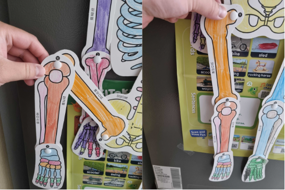

# 01167번 트리의 지름

**Problem link:** [https://www.acmicpc.net/problem/1167](https://www.acmicpc.net/problem/1167)

**Keywords:** `Depth First Search`, `Breadth First Search`, `Tree Diameter`

알고리즘 자체가 워낙 간단하기에, 굳이 다시 풀 필요가 있으려나라는 생각을 한 것이 사실이다.

그런데, [이사오기 전 블로그](https://velog.io/@aram_father/%ED%8A%B8%EB%A6%AC%EC%9D%98-%EC%A7%80%EB%A6%84)에서는 증명까지 들여다봐야 이해가되었던 것이 그냥 직관적으로 이해가 되는 것을 발견하였다.

생각한 것만큼 스스로가 아주 발전없는 인간은 아니라는 생각이 들어서 기쁜 마음에 다시 풀었다.

예전과 동일하게 알고리즘 자체는 몹시 간단하다.

- 트리의 임의의 정점 `x`에서 가장 멀리 떨어진 정점 `y`를 찾자
- 찾은 정점 `y`에서 가장 멀리 떨어진 정점 `z`를 찾자
- `y`로부터 `z`까지의 거리가 곧 트리의 지름이다

가장 멀리 떨어진 정점을 찾는 것은 각자 기호에 맞게 BFS건, DFS건 알아서 사용하면 된다.

이제 보다 중요한 것은 위의 알고리즘이 트리의 지름을 구할 수 있다는 사실을 증명하는 것인데, 중요했던 증명 포인트는 아래와 같았다.

- 트리의 지름이 다음과 같은 정점들로 이루어져 있다고 가정하자.
  - 트리 지름: $$v_{1}, v_{2}, ..., v_{n}$$
- `y`는 처음에 `x`를 뭘 골랐건 상관 없이 $$v_1$$ 또는 $$v_n$$이다.

이전에는 위에 내용을 증명까지해야 이해가 되었었는데, 요즘 첫째 아이 장난감을 많이 가지고 놀아서 그런지 조금 더 직관적으로 이해하는 방법이 떠올랐다.

우리집에는 아래 그림과 같이 생긴 장난감이 있다.



뭔 헛소리를 하나 싶겠지만, 저 장난감의 관절(?)이 트리 노드요, 뼈(?)가 트리 간선이라고 해보자.

장난감의 아무 관절이나 붙잡고 중력에 모든 뼈들이 축 쳐지도록 해보자.

그런데, 잘 생각해보면 중력에 뼈들이 축 쳐지면 당연히 가장 아래로 쳐지는 녀셕이 있기 마련일 것이다.

처음 고른 관절이 트리 지름 상의 관절이라는 것을 보장하지는 못하지만 적어도 아무 관절이나 붙잡고 가장 아래로 쳐지는 녀셕을 찾으면 그게 트리 지름의 한 끝이 될 것이다.

병맛같지만, 꽤나 직관적이지 않는가?

결과적으로 BFS를 두 번 돌리는 코드이니 복잡도는 $$O(\|V\| + \|E\|)$$되시겠다.

아래는 솔루션이다.

```cpp
#include <algorithm>
#include <cstdint>
#include <iostream>
#include <queue>
#include <vector>

using namespace std;

constexpr size_t MAX_V = 100'000;

// Inputs.
int V;
vector<pair<int, int>> ADJ[MAX_V + 1];

// Solution.
vector<int64_t> DIST_PASS_1(MAX_V + 1, -1);
vector<int64_t> DIST_PASS_2(MAX_V + 1, -1);

void DoBfs(int src, vector<int64_t>& dist) {
  queue<int> q;
  dist[src] = 0;
  q.push(src);

  while (!q.empty()) {
    auto here = q.front();
    q.pop();
    for (const auto& edge : ADJ[here]) {
      const auto there = edge.first;
      const auto weight = edge.second;
      if (dist[there] == -1) {
        dist[there] = dist[here] + weight;
        q.push(there);
      }
    }
  }
}

int64_t Solve() {
  DoBfs(1, DIST_PASS_1);

  int64_t max_dist = -1;
  int max_idx = -1;
  for (int i = 1; i <= V; ++i) {
    if (DIST_PASS_1[i] > max_dist) {
      max_dist = DIST_PASS_1[i];
      max_idx = i;
    }
  }

  DoBfs(max_idx, DIST_PASS_2);

  max_dist = -1;
  for (int i = 1; i <= V; ++i) {
    if (DIST_PASS_2[i] > max_dist) {
      max_dist = DIST_PASS_2[i];
    }
  }

  return max_dist;
}

int main(void) {
  // For faster IO.
  ios_base::sync_with_stdio(false);
  cin.tie(nullptr);
  cout.tie(nullptr);

  // Read inputs.
  cin >> V;
  for (int i = 1; i <= V; ++i) {
    int here;
    cin >> here;
    while (true) {
      int there;
      cin >> there;
      if (there == -1) {
        break;
      } else {
        int weight;
        cin >> weight;
        ADJ[here].emplace_back(there, weight);
      }
    }
  }

  // Solve.
  cout << Solve() << "\n";

  return 0;
}
```