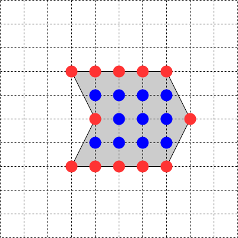
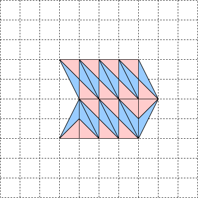

# Pick's Theorem

**Keywords:** `Pick's Theorem`, `픽의 정리`

`Pick's Theorem`는 모든 꼭지점이 격자점 위에 존재하는 특수한 다각형에 대해서, 그 내부의 격자점 수를 헤아릴 때 사용해봄직한 정리이다.

이를 사용해볼 수 있는 online judge 문제로는 [Baekjoon 7694](https://i-am-wonseoklee.github.io/docs/baekjoon-online-judge/07694.html)가 있다.

> `Pick's Theorem:`
> 
> 모든 꼭지점이 격자점 위에 존재하는 다각형에서 다각형의 넓이를 $$A$$, 다각형의 변 위에 있는 격자점의 수를 $$B$$, 다각형의 내부에 있는 격자점의 수(단, 변 위에 있는 경우는 세지 않음)를 $$C$$라고 하자. 이때, 아래의 식이 성립한다.
>
> $$A = \frac{B}{2} + C - 1$$

예를들어, 아래 그림은 $$A = 16,\,B = 12,\,C = 11$$인 경우이고 정리가 잘 성립하는 것을 알 수 있다.

`Pick's Theorem`의 증명을 위해서 아래 2개의 lemma를 도입하도록 하자. 각 lemma는 읽어보면 참 당연한 내용이라서 별도로 증명은 하지 않는다. 나는 수학자가 아니니까.

> `lemma 1`:
> 
> 격자점을 꼭지점으로 하는 삼각형에서 $$(B = 3) \wedge (C = 0)$$인 경우, $$A = \frac{1}{2}$$이다. 이런 삼각형을 기본 삼각형이라고 하자.

> `lemma 2`:
>
> 격자점을 꼭지점으로 하는 모든 다각형은 여러 개의 기본 삼각형으로 나눌 수 있다.

`lemma 1`, `lemma 2`가 이야기하는 내용을 바로 직전에 예시한 다각형에 표현해보면 아래와 같다. 적색과 청색 2가지 타입의 기본 삼각형들을 사용해서 주어진 다각형을 잘 분할한 것을 살필 수 있다.

이제 본격적으로 증명을 시작해보자.

> proof:
>
> 모든 꼭지점이 격자점 위에 있는 다각형을 $$P$$, $$P$$는 $$N$$개의 기본 삼각형으로 분할이 가능하다고 하자.
>
> $$N$$개 기본 삼각형들의 모든 내각의 합은 자명하게 $$N \pi$$ rad이다.
>
> $$N$$개 기본 삼각형들의 모든 내각의 합은 아래와 같이 3가지 경우로 나누어 달리 표현할 수도 있다.
>
>> case 1:
>>
>> $$P$$ **내부**의 임의의 격자점 수를 $$C$$라고 하자. 각 내부 격자점에서 만나는 기본 삼각형들의 내각의 합은 $$2 \pi$$이므로 $$P$$ 내부의 격자점에서 만나는 기본 삼각형들의 내각의 합은 $$2 C \pi$$이다.
>>
>> case 2:
>> 
>> $$P$$의 꼭지점 수를 $$B_{vertex}$$라고 하자. 모든 꼭지점들에서 만나는 기본 삼각형들의 내각의 총합은 $$(B_{vertex} - 2) \pi$$이다(N각형 내각의 합 공식을 떠올리자).
>>
>> case 3:
>>
>> $$P$$의 꼭지점이 아닌 변 위의 격자점 수를 $$B_{\overline{vertex}}$$라고 하자. 이들 각 점에서 만나는 기본 삼각형들의 내각의 합은 $$\pi$$이므로, 이들 위에서 만나는 기본 삼각형 내각의 총합은 $$B_{\overline{vertex}} \pi$$이다.
>
> 따라서, 아래의 관계가 성립한다.
>
> $$
> \begin{align*}
>   N \pi & = 2 C \pi + (B_{vertex} - 2) \pi + B_{\overline{vertex}} \pi \\
>         & = 2 C \pi + (B_{vertex} + B_{\overline{vertex}} - 2) \pi \\
>         & = (2 C + B - 2) \pi
> \end{align*}
> $$
>
> 양변을 $$\pi$$로 나누어 $$N = (2 C + B - 2)$$를 얻을 수 있고, `lemma 1`에서 기본 삼각형의 넓이는 $$\frac{1}{2}$$이므로 $$2 A = N$$이다.
>
> 이를 연립하면 아래를 얻는다.
>
> $$
> \begin{align*}
>   2 A & = (2 C + B - 2) \\
>   A & = \frac{1}{2} B + C -1
> \end{align*}
> $$
>
> QED. $$\square$$
