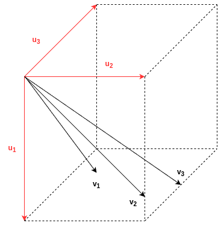
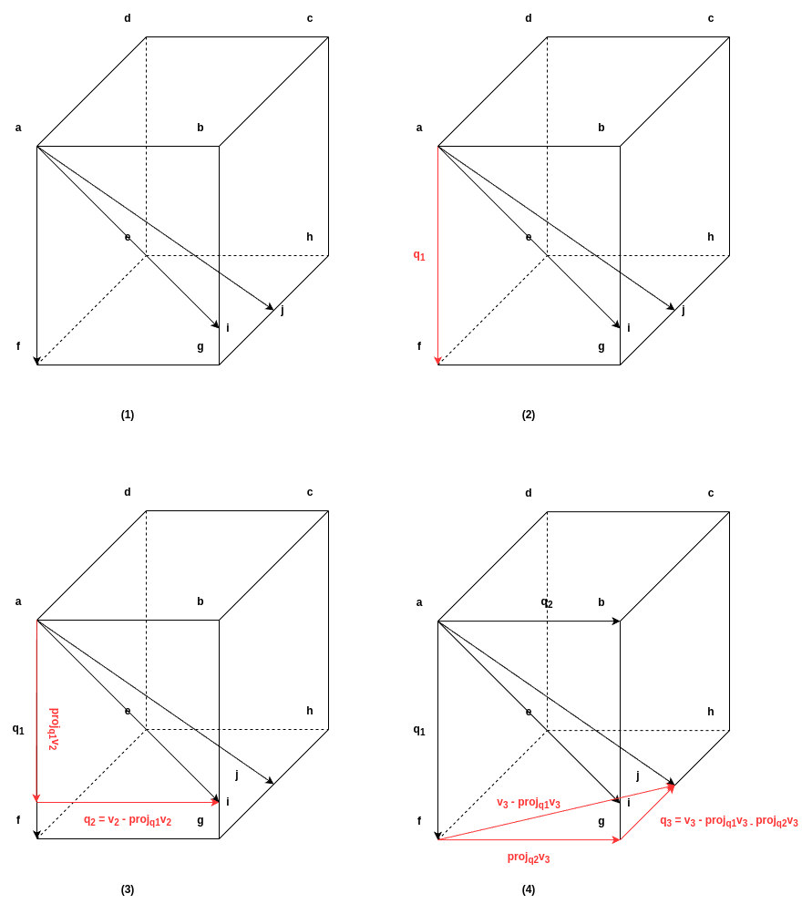

# QR Decomposition

**Textbook:** pp.179 - 192

**Keywords:** `orthogonal matrix`{: .label }, `qr decomposition`{: .label }

## I. Orthogonnal Matrix

직교 행렬 (orthogonal matrix) 이란, **(1)** 모든 열이 서로 직교하고 (i.e. 내적이 0 이고), **(2)** 모든 열의 norm 이 1 인 행렬이다.
달리 말하면, 아래와 같이 column vector의 모음으로 이루어진 행렬이 있다고 해보자.

$$
\mathbf{A} = \left[
{
    \begin{array}{cccc}
    \mathbf{c}_1 & \mathbf{c}_1 & ... & \mathbf{c}_n
    \end{array}
}
\right]
$$

이때, 아래의 조건이 만족한다면 $$\mathbf{A}$$ 는 직교 행렬이다.

$$
\mathbf{A}\ is\ orthogonal\ matrix\ if\
\begin{cases}
<\mathbf{c}_i, \mathbf{c}_j> = 0, & \text{ if } i \neq j \\
<\mathbf{c}_i, \mathbf{c}_j> = 1, & \text{ if } i = j
\end{cases}
$$

이것을 조금 더 우아하게 써본다면, 아래와 같이 적을 수도 있다.

$$
\mathbf{A}\ is\ orthogonal\ matrix\ if\ \mathbf{A}^T\mathbf{A} = \mathbf{I}
$$

그리고, 이로부터 어떠한 직교 행렬 $$\mathbf{Q}$$ (보통 \[큐\] 라고 부르는 듯) 에 대해서 $$\mathbf{Q}^{-1} = \mathbf{Q}^T$$ 라는 아름다운(?) 성질을 하나 얻을 수 있다.

## II. QR Decomposition

임의의 행렬 $$\mathbf{A}$$ 를 직교 행렬과 상삼각 행렬의 곱으로 표현하는 것을 QR 분해 (QR decomposition) 이라고 부른다.
달리 말하면, $$\mathbf{A} = \mathbf{Q}\mathbf{R}$$ 이 되는 직교 행렬 $$\mathbf{Q}$$ 와 상삼각행렬 $$\mathbf{R}$$ 을 찾아내는 과정이 곧 QR 분해이다.

엔지니어라면, 여기서 응당 그래서 "이거 왜 하는건데요?" 라는 질문을 가져야 하리라.
그런데, 애석하게도 책에서는 아직 QR 분해를 어디에 써먹을 수 있는지는 자세히 소개되지는 않았다.
당분간은 주어진 벡터들의 정규직교기저 (orthonormal basis) 를 찾기 위해 쓴다고 이해하자.
이게 뭔 말인지는 그림을 통해 알아보자.

여기 3차원에 이쁘지 않게 아무렇게나 널부러져 있는 3개의 벡터 $$\mathbf{v}_1$$, $$\mathbf{v}_2$$, $$\mathbf{v}_3$$ 이 있다.
그림이 끔찍하게도 2차원 처럼보이지만 상상력을 발휘해 이해해주었으면 한다.
그리고, 이 벡터에 대한 정규직교기저를 $$\mathbf{u}_1$$, $$\mathbf{u}_2$$, $$\mathbf{u}_3$$ 라고 하면, $$
\left[
{
    \begin{array}{ccc}
    \mathbf{v}_1 & \mathbf{v}_3 & \mathbf{v}_3
    \end{array}
}
\right]
=
\mathbf{Q} \mathbf{R}
=
\left[
{
    \begin{array}{ccc}
    \mathbf{u}_1 & \mathbf{u}_2 & \mathbf{u}_3
    \end{array}
}
\right] \mathbf{R}
$$ 이 성립한다 (일단, $$\mathbf{R}$$ 에 대한 이해는 미뤄두도록 하자).

## III. Gram-Schmidt Decomposition

이제 [Gram-Schmit process](https://ko.wikipedia.org/wiki/%EA%B7%B8%EB%9E%8C-%EC%8A%88%EB%AF%B8%ED%8A%B8_%EA%B3%BC%EC%A0%95) 를 통해 QR 분해를 수행하는 방법을 살펴보자.

{: .note }
> - QR 분해를 하는 방법은 수치적으로 안정적인 [Householder reflection](https://ko.wikipedia.org/wiki/%ED%95%98%EC%9A%B0%EC%8A%A4%ED%99%80%EB%8D%94_%EB%B3%80%ED%99%98) 등이 주로 쓰인다고 한다.
> - 하지만, Householder reflection 에 대한 설명은 꽤나 어려워서, 이 책에서는 다뤄지지 않늗다.
> - 대신, 이 책의 수준에서 설명이 가능한 [Gram-Schmit process](https://ko.wikipedia.org/wiki/%EA%B7%B8%EB%9E%8C-%EC%8A%88%EB%AF%B8%ED%8A%B8_%EA%B3%BC%EC%A0%95) 가 소개되었다.

$$\mathbf{V} = \mathbf{Q}\mathbf{R} \Rightarrow \mathbf{Q}^{-1}\mathbf{V} = \mathbf{R} \Rightarrow \mathbf{Q}^T\mathbf{V} = \mathbf{R}$$ 이므로 $$\mathbf{Q}$$ 만 잘 구하면 $$\mathbf{R}$$ 은 쉽게 구할 수 있다.
그러니, $$\mathbf{Q}$$ 를 구하는 과정에만 집중해보자. $$
\mathbf{Q}
=
\left[
{
    \begin{array}{cccc}
    \mathbf{q}_1 & \mathbf{q}_2 & ... & \mathbf{q}_n
    \end{array}
}
\right] 
$$ 라고 하자. $$\mathbf{Q}$$ 는 아래와 같이 구할 수 있다 (단, $$proj_{\mathbf{u}}\mathbf{v}$$ 는 $$\mathbf{v}$$ 를 $$\mathbf{u}$$ 위로 사영한 벡터임).

$$
\mathbf{q}_i
=
\begin{cases}
    normalized(\mathbf{v}_i), \text{ if } i = 1 \\
    normalized(\mathbf{v}_i - \sum_{j=1}^{i-1} proj_{\mathbf{q_j}}\mathbf{v}_i), \text{ if } i \neq 1 \\
\end{cases}
$$

갑자기 뭔 개소리야 싶을텐데, 바로 위 절에서 $$\mathbf{Q}$$ 를 구하는 행위가 곧 $$\mathbf{v}_1, \mathbf{v}_2, ... $$ 의 정규직교기저를 구하는 것이었음을 잘 상기하고 아래 그림을 살펴보자.

설명의 편의를 위해 **(1)** 에서 $$\mathbf{v}_1 = \overrightarrow{af}$$, $$\mathbf{v}_2 = \overrightarrow{ai}$$, $$\mathbf{v}_3 = \overrightarrow{aj}$$ 라고 해보겠다.
"갑자기 네 맘대로 왜 정육면체 같은 것을 넣었니?" 같은 의문이 들었다면, 임의의 정육면체 한 변을 $$\mathbf{v}_1$$ 에 일치시킴으로서 늘 일반화 가능한 상황임을 유념하자.

**(2)** 과정은 Gram-Schmidt 과정에 따라 자명하게 $$\mathbf{q}_1 = \mathbf{v}_1$$ 이 되는 것을 보인 것이다.

**(3)** 과정은 $$\mathbf{v}_2$$ 에서 $$proj_{\mathbf{q}_1}\mathbf{v}_2$$ 를 빼줌으로서 $$\mathbf{q}_1$$ 에 평행한 성분을 모두 제거해버리고, 남은 수직 성분을 $$\mathbf{q}_2$$ 로 만든 것을 보여준다.

**(4)** 과정도 비슷하게 $$\mathbf{v}_2$$ 에서 앞서 정의된 basis들 ($$\mathbf{q}_1$$, $$\mathbf{q}_2$$) 과 평행한 성분을 날려버리고 수직 성분만 남겨 $$\mathbf{q}_3$$ 를 만든 것이다.

(조금 문학적인 수사를 사용한다면) 결국 Gram-Schmidt 과정은 매 스텝마다 앞서 정의된 basis 들에 평행한 성분을 제거하여 수직 성분만 남기는 과정임을 알 수 있다.

## IV. Exercises

이 챕터의 연습문제 풀이는 [여기](https://github.com/i-am-wonseoklee/i-am-wonseoklee.github.io/tree/main/docs/linalg/07-qr-decomposition/exercises)에서 확인할 수 있다.

