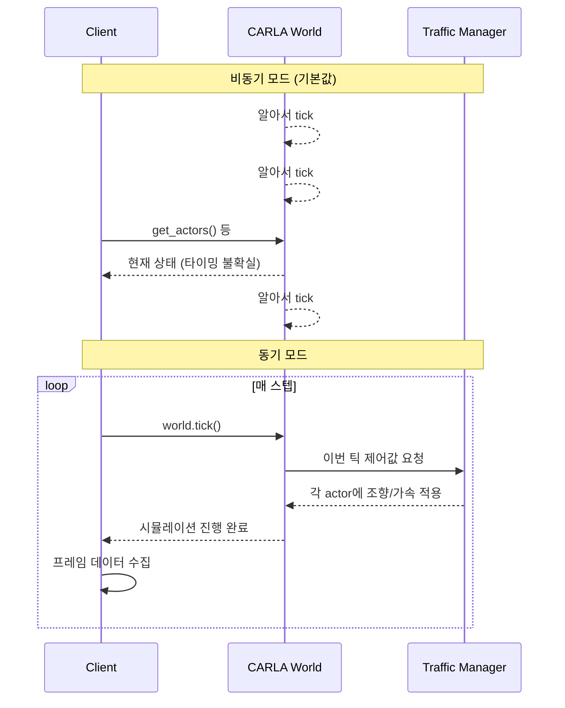

# Implementation Note

## TOC
{: .no_toc }

1. TOC
{:toc}


이 포스팅에서 다루는 구현 코드는 아래 리포지토리에서 확인할 수 있다.

- **reproducing-PlanT**: [link](https://github.com/i-am-wonseoklee/reproducing-PlanT)

이 포스팅은 세 갈래로 구성된다.
재현성을 높이기 위해 원본 코드에 추가한 작업, 논문을 직접 구현하면서 마주친 특이 사항, 그리고 최종 구현 결과를 순서대로 정리했다.

## I. 추가 작업

### I.1. Dev Container

딥러닝 논문을 재현하는 일의 절반은 알고리즘을 이해하는 것이고, 나머지 절반은 환경을 맞추는 것이다.
그리고 솔직히 말해, 후자가 훨씬 더 고통스러울 때가 많다.
CUDA 버전과 PyTorch 버전의 궁합은 끔찍하게 복잡하고, 의존성 지옥에 한 번 발을 들이면 정작 논문 내용은 까맣게 잊은 채 패키지 버전과 씨름하다 하루가 끝난다.

여기에 `CARLA`까지 가세한다면 이야기는 한 단계 더 심각해진다.
`CARLA`는 자율주행 시뮬레이터 중 사실상 표준으로 통하는 오픈소스 플랫폼이지만, 설치와 설정이 번잡스럽기로도 나름 명성이 높다.
서버 프로세스를 따로 띄워야 하고, Python 클라이언트 버전도 맞춰야 하고, GPU 드라이버도 눈치를 봐야 한다.
심지어 모든 의존성을 잘 맞춰놓았다고 생각하는 순간 이유도 모른 채 그냥 죽어버리기도 한다.

그래서 필자는 `CARLA`를 포함한 전체 개발 환경을 **Dev Container**로 묶어버렸다.
`devcontainer.json` 하나로 환경을 통째로 재현할 수 있고, 적어도 "내 컴퓨터에선 됐는데"라는 변명 하나는 사라진다.

### I.2. Data Curation

원본 데이터셋은 JSON 파일의 집합이다.
각 프레임마다 파일 하나씩, 수천 개의 JSON이 디렉터리를 가득 채운다.
파일을 열어보면 숫자들이 빼곡한데, 이게 차선 변경 중인 장면인지, 정지 신호 앞에서 멈춘 장면인지, 아니면 그냥 직진하는 장면인지 전혀 감이 오지 않는다.
학습 데이터가 어떻게 생겼는지 파악하는 것은 모델을 이해하는 것만큼이나 중요한데, 이 형태로는 사람이 직접 들여다보기가 너무 불편하다.

그래서 데이터셋을 수집하는 파이프라인을 새로 짜고, 결과물을 **SQLite DB**로 쌓도록 바꿨다.
각 프레임을 레코드 하나로 정리하고, BLOB 필드에는 해당 프레임의 장면을 시각화한 이미지를 함께 저장했다.
덕분에 SQL 한 줄로 원하는 조건의 데이터를 뽑아볼 수 있고, DB 브라우저로 이미지를 훑으며 데이터가 실제로 어떻게 생겼는지 눈으로 확인할 수 있다.
숫자 더미를 들여다보며 "이게 뭔 장면이지" 하고 멍하니 앉아 있는 시간이 확실히 줄었다.

|  |
|:--:|
| <em>Figure 1. SQLite DB에 저장된 프레임 시각화 예시. Red bbox: Ego vehicle, Blue bboxes: Obstacles (vehicles), Green line: Waypoints, Green/Red circles: Traffic lights.</em> |

|  |
|:--:|
| <em>Figure 2. SQLite DB에 저장된 프레임 시각화 예시(학습 데이터셋 형태). Red bbox: Ego vehicle, Blue bboxes: Obstacles (vehicles), Green boxes: Routes, Yellow stars: Target points, White circles: Labeled waypoints.</em> |

## II. 구현 특이 사항

### II.1. CARLA, CARLA, CARLA...

`PlanT`는 데이터셋 수집과 closed-loop 시뮬레이션 평가 모두에 `CARLA`를 사용한다.
그런데 필자는 `CARLA`를 써본 적이 없었고, 공식 문서는 솔직히 말해 썩 친절하지 않다.
그래서 직접 부딪히며 배운 내용을 정리해둔다.

#### II.1.A. CARLA의 동작 방식

`CARLA`는 기본적으로 **비동기(async) 모드**로 동작한다.
서버가 알아서 시뮬레이션을 돌리고, 클라이언트는 그 흐름에 편승해 데이터를 가져가는 방식이다.
그런데 이 방식으로는 데이터 수집 타이밍을 제어하기가 어렵다.
따라서, 데이터 수집에는 **동기(sync) 모드**를 써야 한다.
동기 모드에서는 클라이언트가 `world.tick()`을 호출해야만 시뮬레이션이 한 스텝 진행된다.
시계를 클라이언트가 쥐고 있는 셈이니, 원하는 간격으로 정확하게 데이터를 수집할 수 있다.
`fixed_delta_seconds`를 함께 설정하면 한 틱이 몇 초짜리인지도 고정된다.

두 모드의 차이를 그림으로 정리하면 다음과 같다.



한 가지 함정은, **Traffic Manager(TM)도 따로 동기 모드로 바꿔줘야 한다**는 것이다.
`world`만 동기 모드로 설정하고 TM을 그냥 두면, TM은 자체 C++ 스레드에서 여전히 비동기로 동작한다.
그러면 클라이언트가 틱을 밟는 타이밍과 TM이 차량을 제어하는 타이밍이 어긋나 시뮬레이션이 엉켜버린다.

```python
settings.synchronous_mode = True
settings.fixed_delta_seconds = 1.0 / self.config.fps
self.world.apply_settings(settings)

traffic_manager = self.client.get_trafficmanager()
traffic_manager.set_synchronous_mode(True)  # 이걸 빠뜨리면 안 된다
```

#### II.1.B. Actor를 주행시키고 데이터를 수집하는 법

차량(ego 및 NPC)은 모두 TM의 **autopilot**에 맡겨 주행시킨다.
ego는 차선 변경 없이 직진만 하도록 TM 옵션을 별도로 꺼뒀다.

```python
tm.auto_lane_change(self.ego, False)
tm.random_left_lanechange_percentage(self.ego, 0.0)
tm.random_right_lanechange_percentage(self.ego, 0.0)
```

route waypoint는 `world.get_map().get_waypoint()`를 이용해 ego 위치를 도로에 스냅하는 방식으로 얻는다.
여기에 한 가지 주의할 점이 있다.
교차로 같은 지점에서는 스냅된 waypoint가 ego가 실제로 주행 중인 도로가 아니라 **교차하는 도로**에 붙어버리는 경우가 있다.
이를 걸러내기 위해 스냅된 waypoint의 yaw가 ego의 실제 heading과 90° 이상 차이 나면 해당 프레임을 버리도록 했다.

```python
diff = abs(math.atan2(math.sin(wp_yaw - ego_yaw), math.cos(wp_yaw - ego_yaw)))
if diff > math.pi / 2:
    return None  # 이 프레임은 수집하지 않는다
```

#### II.1.C. 주의사항: 그래도 간혹 죽는다

모든 것을 잘 맞춰도 `CARLA`는 때때로 예고 없이 죽는다.
더 당혹스러운 것은 **죽는 순서와 방법이 정해져 있다**는 것이다.
순서를 어기면 Python 예외가 아니라 C++ 레벨에서 abort가 발생하고, 그냥 프로세스가 꺼진다.

필자가 확인한 지뢰 목록은 다음과 같다.

**1. actor를 destroy하기 전에 반드시 autopilot을 해제해야 한다.**
TM은 자신이 제어하는 actor의 C++ 참조를 내부적으로 들고 있다.
`destroy()`를 먼저 호출하면 서버 쪽 actor는 사라지지만 TM C++ 스레드는 이를 모른 채 계속 해당 actor를 제어하려 들고, 그 순간 abort된다.
autopilot을 끄고, 틱을 한 번 밟아 TM이 변경을 처리하게 한 다음, 그때 destroy해야 한다.

```python
for actor in all_actors:
    actor.set_autopilot(False)
self.world.tick()  # TM이 unregistration을 처리할 틱
for actor in all_actors:
    actor.destroy()
```

**2. TM sync 모드는 world sync 모드보다 먼저 꺼야 한다.**
반대 순서로 끄면 다음 에피소드에서 `load_world()`를 호출할 때 TM C++ 스레드가 데드락에 걸려 `TimeoutException`으로 abort된다.
Python에서 잡을 수 없는 예외라 그냥 죽는다.

```python
tm.set_synchronous_mode(False)    # 먼저
settings.synchronous_mode = False
self.world.apply_settings(settings)  # 나중에
```

**3. 에피소드마다 `carla.Client`를 새로 만들어야 한다.**
`carla.Client`를 재사용하면 TM C++ 스레드에 상태가 누적되고, 여러 에피소드가 지나면서 결국 `TimeoutException` abort로 터진다.
찜찜하지만 에피소드 시작마다 클라이언트를 새로 연결하는 것이 현재로서는 가장 안정적인 방법이었다.

## III. 구현 결과

<!-- 학습 곡선, 최종 성능 수치, 논문 보고값과의 비교 등 -->

<script src="https://utteranc.es/client.js"
        repo="i-am-wonseoklee/i-am-wonseoklee.github.io"
        issue-term="pathname"
        theme="github-dark-orange"
        crossorigin="anonymous"
        async>
</script>
