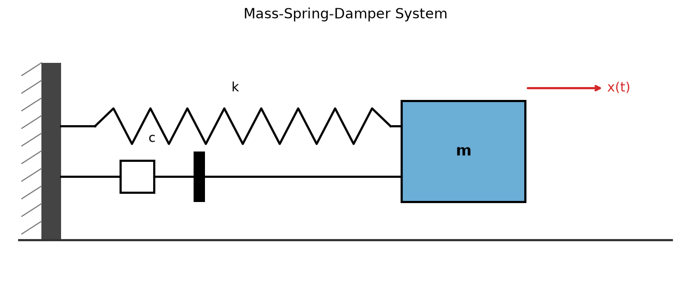
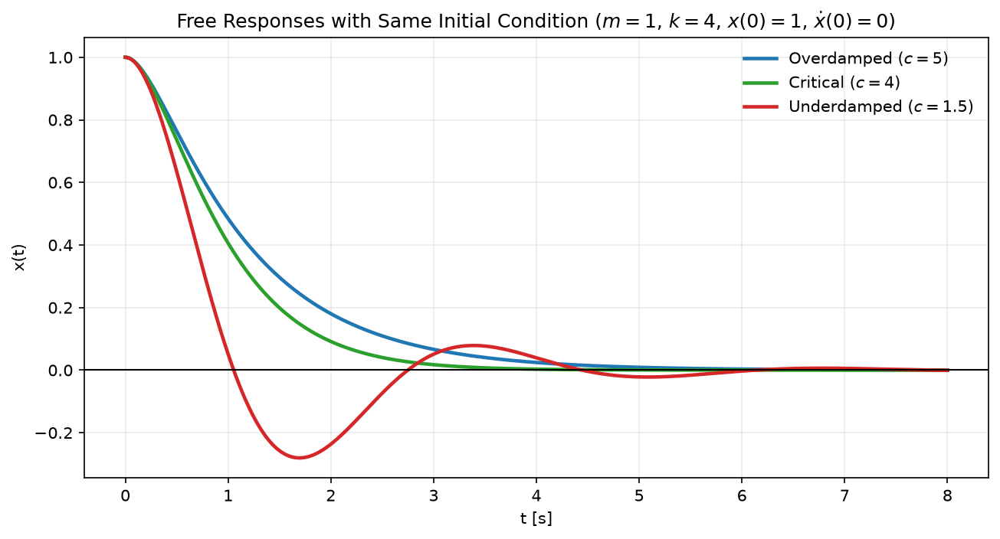
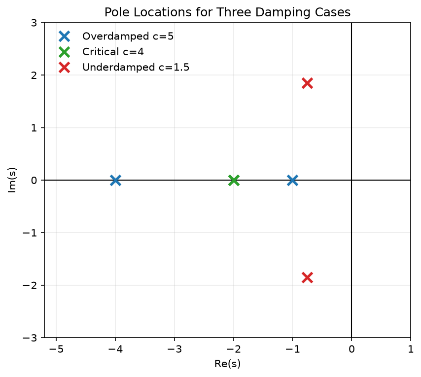

# Laplace Transform

## TOC
{: .no_toc }

1. TOC
{:toc}

**Keywords:** `Laplace Transform`{: .label }, `Complex Frequency`{: .label }

라플라스 변환(Laplace transform).
공학을 전공했다면 누구나 한 번쯤 들어 보았을 이름이다.
아마 두세 학기에 걸쳐 라플라스 변환으로 수많은 연습문제를 풀어 보았을 것이다.
그런데도 필자에게 이 변환은 좀처럼 직관적으로 와닿지 않았다.
가령 질량-스프링-댐퍼 시스템을 나타내는 아래와 같은 미분방정식을 생각해 보자.

$$
m\ddot{x}(t) + c\dot{x}(t) + kx(t) = 0
$$

시간 영역에서 $$x(t)$$는 시각 $$t$$에서 질량의 위치를 뜻하고, $$\dot{x}(t)$$와 $$\ddot{x}(t)$$는 각각 속도와 가속도를 뜻한다.
각 항의 물리적 의미가 비교적 분명하다.
하지만 이 방정식에 라플라스 변환을 적용하면 갑자기 복소변수 $$s$$에 대한 함수 $$X(s)$$가 등장한다.
여기서 $$s$$는 무엇이며, 특정한 $$s$$에서 얻는 값 $$X(s)$$는 원래 신호의 무엇을 나타내는가?
공식에 따라 계산할 수는 있었지만, 이 질문 앞에서는 번번이 길을 잃곤 했다.

이 글에서는 라플라스 변환의 계산법을 나열하는 데 그치지 않고, 시간 신호를 왜 복소변수 $$s$$의 함수로 옮겨 바라보는지 살펴보려 한다.
나아가 변환된 함수 $$X(s)$$와 그 함수의 각 값이 원래 신호에 관해 무엇을 말해 주는지도 차근차근 짚어 보자.

## I. 라플라스 변환이란

라플라스 변환은 시간에 따라 변하는 함수 $$x(t)$$를 새로운 변수 $$s$$에 대한 함수 $$X(s)$$로 옮기는 적분 변환이다.
이 글에서는 시스템이 동작하기 시작하는 시각을 $$t=0$$으로 두고, 그 이후의 신호를 다루는 **단측 라플라스 변환** 만을 살펴본다.

$$
X(s)
= \mathcal{L}\{x(t)\}
= \int_{0^-}^{\infty} x(t)e^{-st}\,dt
$$

여기서 $$\mathcal{L}$$은 라플라스 변환이라는 연산을, $$X(s)$$는 그 연산의 결과를 나타낸다.
즉 $$x(t)$$와 $$X(s)$$는 서로 다른 두 신호가 아니라, 같은 대상을 서로 다른 변수의 관점에서 표현한 것이다.

$$
x(t) \quad \xrightarrow{\ \mathcal{L}\ } \quad X(s)
$$

여기서 $$t$$는 시간을, $$s$$는 복소변수를 나타낸다.
정의에 따라 적분하면 시간함수 $$x(t)$$는 $$s$$에 대한 함수 $$X(s)$$로 변환된다.
$$s$$와 $$X(s)$$가 갖는 구체적인 의미는 뒤에서 별도로 살펴본다.
라플라스 변환은 단순히 식의 $$t$$를 $$s$$로 바꾸는 치환이 아니다.
정의에 따라 적분을 수행하여 시간에 대한 함수를 새로운 형태로 표현하는 연산이다.

## II. 변환 결과의 모양에서 먼저 보이는 것

라플라스 변환을 수행하면 결과가 어떤 형태로 나타나는지부터 살펴보자.
여기서는 모든 시간함수가 $$t\geq0$$에서 주어진 것으로 가정한다.

가장 간단한 상수함수 $$x(t)=1$$의 라플라스 변환은 다음과 같다.

$$
x(t)=1
\quad\xrightarrow{\ \mathcal{L}\ }\quad
X(s)=\frac{1}{s}
$$

감쇠하는 지수함수 $$x(t)=e^{-at}$$는 다음과 같이 변환된다.

$$
x(t)=e^{-at}
\quad\xrightarrow{\ \mathcal{L}\ }\quad
X(s)=\frac{1}{s+a}
$$

사인과 코사인도 마찬가지로 $$s$$에 대한 함수로 바뀐다.

$$
\begin{align}
\sin{\omega t}
&\quad\xrightarrow{\ \mathcal{L}\ }\quad
\frac{\omega}{s^2+\omega^2}, \\
\cos{\omega t}
&\quad\xrightarrow{\ \mathcal{L}\ }\quad
\frac{s}{s^2+\omega^2}
\end{align}
$$

변환 전의 함수는 시간변수 $$t$$에 따라 값이 달라졌지만, 변환 후의 함수에는 $$t$$가 남아 있지 않다.
대신 새로운 변수 $$s$$가 들어 있는 함수 $$X(s)$$가 나타난다.
예를 들어 $$e^{-at}$$의 라플라스 변환은 특정한 수 하나가 아니라, $$s$$에 따라 값이 달라지는 함수 $$1/(s+a)$$다.
위의 결과에서는 또 하나의 공통점을 볼 수 있다.
시간 영역의 상수함수, 지수함수, 사인 및 코사인이 변환 후에는 모두 다항식의 비로 표현되었다.

$$
X(s)=\frac{N(s)}{D(s)}
$$

이와 같은 형태를 **유리함수(rational function)** 라고 한다.
분자 $$N(s)$$가 0이 되는 지점을 영점(zero), 분모 $$D(s)$$가 0이 되는 지점을 극점(pole)이라고 한다.
가령 $$e^{-at}$$의 변환 결과 $$1/(s+a)$$는 $$s=-a$$에서 분모가 0이 되고, $$\sin{\omega t}$$의 변환 결과는 $$s=\pm j\omega$$에서 분모가 0이 된다.
지금은 시간함수가 이러한 유리함수로 바뀐다는 결과만 확인해 두자.
왜 지수함수와 복소수 $$s$$가 등장하는지, 그리고 극점의 위치가 원래 신호에 관해 무엇을 말해 주는지는 뒤에서 차례로 살펴본다.

## III. $$s$$는 왜 등장하며, $$X(s)$$는 무엇을 뜻하는가

시간함수 $$x(t)$$는 해석이 직관적이다.
자명하게 $$x(t_0)$$는 시각 $$t_0$$에서 읽은 신호의 값이다.
반면 $$X(s_0)$$는 그 의미가 조금 복잡하다.
굳이 한마디로 말하자면, $$s_0 = \sigma_0 + j\omega_0$$일 때 $$X(s_0)$$는 $$x(t)$$가 $$e^{-\sigma_0 t}$$로 감쇠하고 $$-\omega_0$$로 진동하는 신호와 얼마나 닮았는지를 나타내는 점수로 이해할 수 있다.
이제부터 이 설명이 정확히 무엇을 의미하는지 자세히 살펴보자.
우선 라플라스 변환이 $$t=0$$ 이후의 신호 전체를 사용해 $$X(s_0)$$라는 값 하나를 만든다는 사실에서 시작하자.

$$
X(s_0)
=
\int_{0^-}^{\infty}x(t)e^{-s_0t}\,dt
$$

이 적분의 구조를 눈여겨보자.
두 함수를 곱해 적분하는 연산은 벡터의 내적과 비슷한 구조를 가진다.
두 벡터의 방향이 비슷하면 내적이 크고 수직이면 0이 되듯이, 두 함수의 변화 양상이 비슷하면 곱이 같은 부호로 누적되어 값이 커지고, 다르면 양수와 음수가 섞여 서로 상쇄된다.
따라서 이 적분값은 두 함수가 얼마나 겹치는지를 나타내는 일종의 **닮음 점수**로 볼 수 있다.
여기서 $$s_0$$는 어떤 함수와 비교할지를 정하는 설정값이다.

### III.1. 실수 $$s$$: 지수 가중으로 누적하기

먼저 $$s_0=\sigma$$가 양의 실수인 경우를 보자.

$$
X(\sigma)
=
\int_{0^-}^{\infty}x(t)e^{-\sigma t}\,dt
$$

$$e^{-\sigma t}$$는 시간이 흐를수록 작아지므로 신호의 앞부분에는 큰 값을, 뒷부분에는 작은 값을 곱한다.
$$\sigma$$가 클수록 곱하는 값이 더 빠르게 작아진다.
예를 들어 $$x(t)=1$$이면 다음과 같다.

$$
X(\sigma)
=
\int_{0^-}^{\infty}e^{-\sigma t}\,dt
=
\frac{1}{\sigma}
$$

같은 신호라도 $$\sigma=1$$이면 1, $$\sigma=2$$이면 $$1/2$$이다.
곱한 함수가 달라졌으므로 적분값도 달라진 것이다.
즉 비교 함수가 더 빠르게 감쇠할수록, 원래 신호와의 닮음 점수는 더 작아진다.

### III.2. 진동을 재려는 순간 문제가 생긴다

이제 신호 안에 각주파수 $$\omega$$로 진동하는 성분이 얼마나 들어 있는지 재고 싶다고 하자.
자연스러운 시도는 같은 주파수의 코사인을 곱해 적분하는 것이다.

$$
\int_{0^-}^{\infty} x(t)\cos{\omega t}\,dt
$$

신호가 $$\cos{\omega t}$$와 비슷하게 진동하면 곱이 양수로 계속 쌓여 큰 값이 나온다.
그럴듯해 보인다.
그런데 신호가 정확히 $$x(t)=\sin{\omega t}$$라면 어떻게 될까.
주파수가 완벽하게 일치하는데도 결과는 다음과 같다.

$$
\begin{align}
\int_{0^-}^{\infty} \sin{\omega t}\cos{\omega t}\,dt
&=
\frac{1}{2}\int_{0^-}^{\infty} \sin{2\omega t}\,dt \\
&=0
\end{align}
$$

양의 덩어리와 음의 덩어리가 정확히 번갈아 나와 모두 상쇄된다.
분명히 $$\omega$$로 진동하는 신호인데, 코사인 프로브는 이를 전혀 잡아내지 못한다.
원인은 **위상**이다.
사인은 코사인보다 위상이 90도 어긋나 있고, 코사인 하나로는 이 방향의 진동이 보이지 않는다.
진동에는 자유도가 두 개 있다.
얼마나 세게 진동하는가, 그리고 어떤 위상으로 진동하는가.
프로브 하나로는 이 둘을 함께 잴 수 없다.

### III.3. 그래서 두 번 잰다

해결책은 단순하다.
서로 90도 어긋난 프로브 두 개로 각각 재면 된다.
코사인과 사인은 정확히 90도 위상차이를 가지고 있으며, 이 둘은 **직교(orthogonal)** 관계다.
따라서 임의의 $$\omega$$로 진동하는 신호는 코사인과 사인의 선형결합으로 유일하게 표현되므로, 이 둘만 있으면 모든 진동 성분을 완전히 잡아낼 수 있다.

$$
a=\int_{0^-}^{\infty} x(t)\cos{\omega t}\,dt,
\qquad
b=\int_{0^-}^{\infty} x(t)\sin{\omega t}\,dt
$$

신호가 어떤 위상으로 진동하든, 코사인이 놓친 만큼을 사인이 잡아낸다.
두 측정값을 합친 크기는 $$\sqrt{a^2+b^2}$$이고, 위상은 $$a$$와 $$b$$의 비율에서 결정된다.
신호의 실제 진폭을 얻으려면 관측구간에 맞는 정규화가 추가로 필요하다.
핵심은 측정 결과가 **실수 두 개짜리 쌍 $$(a,\,b)$$** 라는 점이다.

### III.4. 허수는 실수 쌍을 담는 그릇이다

두 값을 매번 따로 들고 다니는 대신 한 기호에 묶어 쓰면 편하다.
복소수 $$a+jb$$는 두 실수 $$a$$와 $$b$$를 한 쌍으로 묶은 값으로 볼 수 있다.
2차원 평면에서 한 점의 좌표를 (x좌표, y좌표)가 아니라 복소수 $$x+jy$$로 나타내는 것과 같다.
[오일러 공식](/docs/topic-dive/06-euler-formula)($$e^{-j\omega t}=\cos{\omega t}-j\sin{\omega t}$$)을 이용하면 코사인 프로브와 사인 프로브를 하나의 복소지수함수에 담을 수 있다.
이를 신호에 곱해 적분하면 두 측정이 한 번에 이루어진다.

$$
\int_{0^-}^{\infty} x(t)e^{-j\omega t}\,dt
=
\underbrace{\int_{0^-}^{\infty} x(t)\cos{\omega t}\,dt}_{a}
-j\underbrace{\int_{0^-}^{\infty} x(t)\sin{\omega t}\,dt}_{b}
=
a-jb
$$

여기서 $$j$$는 신호에 어떤 ‘허수적인’ 작용을 하는 것이 아니다.
**코사인 측정값은 실수부 칸에, 사인 측정값은 허수부 칸에 넣으라는 주소 표시**일 뿐이다.
신호는 처음부터 끝까지 실수이고, 복소수가 된 것은 측정 결과의 표기다.
극형식으로 쓰면 이 복소수의 크기 $$\sqrt{a^2+b^2}$$는 두 측정값을 합친 크기를, 각도는 두 측정값의 상대적인 비율을 나타낸다.

### III.5. 지수 가중과 진동을 하나의 함수로

앞에서는 진동 성분을 측정하는 원리를 코사인/사인 프로브로 살펴보았다.
라플라스 변환은 $$t=0$$부터 무한대까지 적분하므로, 신호의 뒤쪽을 줄이는 지수 가중 $$e^{-\sigma t}$$를 함께 사용한다.
이를 진동을 측정하는 $$e^{-j\omega t}$$와 곱하면 지수의 성질에 따라 하나의 함수로 합쳐진다.

$$
e^{-\sigma t}e^{-j\omega t}
=e^{-(\sigma+j\omega)t}
$$

여기서 두 매개변수를 하나의 기호로 묶은 것이 복소변수 $$s$$다.

$$
s=\sigma+j\omega
$$

이제 정의에 $$s=\sigma+j\omega$$를 대입하면 다음과 같다.

$$
\begin{align}
X(\sigma+j\omega)
&=
\int_{0^-}^{\infty}
x(t)e^{-\sigma t}e^{-j\omega t}\,dt \\
&=
\int_{0^-}^{\infty}
x(t)e^{-\sigma t}\cos{\omega t}\,dt \\
&\quad
-j\int_{0^-}^{\infty}
x(t)e^{-\sigma t}\sin{\omega t}\,dt
\end{align}
$$

즉 $$X(\sigma+j\omega)$$의 실수부는 $$e^{-\sigma t}$$를 곱한 뒤 구한 코사인 측정값이고, 허수부는 같은 방식으로 구한 사인 측정값에 음수를 붙인 것이다.
복소수 하나에 두 측정이 함께 담겨 있다.

## IV. 극점과 영점이 말해 주는 것

라플라스 변환 결과 $$X(s)$$는 일반적으로 다음과 같은 유리함수 형태다.

$$
X(s) = \frac{(s-z_1)(s-z_2)\cdots(s-z_m)}{(s-p_1)(s-p_2)\cdots(s-p_n)}
$$

여기서 $$z_i$$들은 영점(zero)이고 $$p_i$$들은 극점(pole)이다.
이 두 가지 값이 원래 신호 $$x(t)$$의 동작을 완전히 결정한다.

### IV.1. 극점과 시스템의 안정성

극점의 위치는 시간 신호에 대해 가장 직접적인 영향을 미친다.
역라플라스 변환을 수행하면, 각 극점 $$p_i$$에 해당하는 항이 $$e^{p_i t}$$ 형태로 시간 신호에 나타난다.
예를 들어 극점이 $$p = -2$$라면, 시간 신호에 $$e^{-2t}$$ 항이 나타나서 신호가 기하급수적으로 감쇠한다.
반면 극점이 $$p = 2$$라면 $$e^{2t}$$ 항이 나타나서 신호가 발산한다.
따라서 **극점의 실부가 음수**이면 신호는 시간이 지나면서 0으로 수렴하고, **양수**이면 발산한다.
이를 시스템의 **안정성(stability)** 이라고 부른다.
특히 모든 극점이 복소평면의 **좌반평면(left half-plane)** 에 있을 때만 시스템이 안정하다.

### IV.2. 극점과 신호의 시간 응답

극점의 실부는 **감쇠 속도**를 결정한다.
극점의 실부가 $$-\sigma$$일수록 (더 음수일수록) 신호가 더 빠르게 감쇠한다.
예를 들어 $$p_1 = -1$$인 극점보다 $$p_2 = -5$$인 극점을 가진 신호가 훨씬 빠르게 0으로 수렴한다.
극점의 허부는 **진동 주파수**를 결정한다.
안정적인 시스템에서 극점은 복소평면의 좌반평면에 있으므로, 일반적으로 복소 극점 쌍은 $$p = -\sigma \pm j\omega$$ 형태다 (여기서 $$\sigma > 0$$).
이 경우 시간 신호에 $$e^{-\sigma t}\cos(\omega t)$$ 형태의 진동이 나타난다.
$$\sigma$$는 신호가 감쇠하는 속도를, $$\omega$$는 진동하는 주파수를 결정한다.
허부의 크기 $$|\omega|$$가 클수록 진동이 더 빠르게 반복되고, 실부의 크기 $$\sigma$$가 클수록 더 빠르게 0으로 수렴한다.
따라서 이러한 복소 극점 쌍은 시간 영역에서 **감쇠하는 진동(damped oscillation)** 을 만든다.

### IV.3. 극점과 영점의 배치가 주는 정보

극점과 영점의 위치를 복소평면에 그린 그림을 **극점-영점 플롯(pole-zero plot)** 이라고 한다.
이 그림 하나만 봐도 시스템의 전체적인 동작 특성을 한눈에 파악할 수 있다.

- 모든 극점이 좌반평면에 있으면 안정 시스템
- 극점이 우반평면에 있으면 불안정 시스템
- 극점이 허수축에 있으면 경계 사례(지속적인 진동)
- 극점 쌍의 실부가 같으면 감쇠 속도가 같음
- 극점 쌍의 허부가 크면 빠른 진동

역으로 말하면, 시스템 설계 문제에서는 원하는 응답 특성에 맞게 극점을 배치하는 것이 핵심이다.
이를 **극점 배치(pole placement)** 라고 하며, 제어공학의 중요한 주제다.

## V. 미분방정식이 대수방정식으로 바뀌는 과정

라플라스 변환의 가장 큰 장점은 미분방정식을 대수방정식으로 변환한다는 점이다.
이를 가능하게 하는 핵심은 라플라스 변환의 **미분 성질**이다.

### V.1. 미분 성질

시간 함수의 미분은 라플라스 변환에서 다음과 같이 변환된다.

$$
\mathcal{L}\{\dot{x}(t)\} = sX(s) - x(0^-)
$$

여기서 $$x(0^-)$$는 초기값이고, 시간 미분이 단순히 $$s$$를 곱하는 연산으로 바뀐다.
2차 미분은 이 성질을 한 번 더 적용하면 된다.

$$
\mathcal{L}\{\ddot{x}(t)\} = s^2X(s) - sx(0^-) - \dot{x}(0^-)
$$

### V.2. 미분방정식을 대수방정식으로

예를 들어 다음과 같은 1차 미분방정식을 생각해보자.

$$
\dot{x}(t) + 2x(t) = u(t)
$$

여기서 $$u(t)$$는 입력 신호이고, $$x(t)$$는 출력 신호다.

양변에 라플라스 변환을 적용하면:

$$
\mathcal{L}\{\dot{x}(t) + 2x(t)\} = \mathcal{L}\{u(t)\}
$$

선형성에 의해:

$$
\mathcal{L}\{\dot{x}(t)\} + 2\mathcal{L}\{x(t)\} = \mathcal{L}\{u(t)\}
$$

미분 성질을 적용하면:

$$
sX(s) - x(0^-) + 2X(s) = U(s)
$$

이제 $$X(s)$$에 대해 정리할 수 있다.

$$
(s+2)X(s) = U(s) + x(0^-)
$$

$$
X(s) = \frac{U(s) + x(0^-)}{s+2}
$$

**미분방정식이 대수방정식으로 변환되었다!**

이제 $$U(s)$$와 초기값이 주어지면 $$X(s)$$를 구하는 것은 단순 계산이다.
그 후 역라플라스 변환으로 시간 영역의 해 $$x(t)$$를 얻는다.

## VI. 질량-스프링-댐퍼 시스템으로 돌아가 보기

처음에 언급했던 질량-스프링-댐퍼 시스템으로 돌아가 보자.

$$
m\ddot{x}(t) + c\dot{x}(t) + kx(t) = 0
$$

편의를 위해 초기값은 다음처럼 고정해서 보자.

$$
x(0)=1,\qquad \dot{x}(0)=0
$$

양변에 라플라스 변환을 적용하면:

$$
m\mathcal{L}\{\ddot{x}(t)\} + c\mathcal{L}\{\dot{x}(t)\} + k\mathcal{L}\{x(t)\}=0
$$

미분 성질을 대입하면:

$$
m\big(s^2X(s)-sx(0)-\dot{x}(0)\big)+c\big(sX(s)-x(0)\big)+kX(s)=0
$$

초기값 $$x(0)=1$$, $$\dot{x}(0)=0$$를 넣어 정리하면:

$$
(ms^2+cs+k)X(s)=ms+c
$$

$$
X(s)=\frac{ms+c}{ms^2+cs+k}
$$

핵심은 분모다.
분모가 0이 되는 지점, 즉 극점은

$$
ms^2+cs+k=0,
\qquad
s=\frac{-c\pm\sqrt{c^2-4mk}}{2m}
$$

으로 주어진다.
따라서 감쇠비(즉 $$c$$의 크기)에 따라 응답 모양이 세 가지로 갈린다.

- **$$c^2>4mk$$** (과감쇠): 서로 다른 두 실극점, 진동 없이 천천히 수렴
- **$$c^2=4mk$$** (임계감쇠): 중근, 진동 없이 가장 빠르게 수렴
- **$$c^2<4mk$$** (과소감쇠): 켤레복소수 극점, 감쇠하면서 진동

아래 그림은 $$m=1, k=4, x(0)=1, \dot{x}(0)=0$$를 고정하고 $$c$$만 바꿨을 때의 시간응답이다.

같은 조건에서 극점 위치를 그리면 왜 응답이 달라지는지 더 명확해진다.

정리하면, 질량-스프링-댐퍼 문제에서 라플라스 변환은
시간영역 미분방정식을 $$X(s)$$의 유리함수로 바꾸고,
그 극점 위치만으로 응답의 형태(진동 유무, 감쇠 속도)를 빠르게 읽어내게 해 준다.

## VII. 라플라스 변환을 사용하는 방법

지금까지 라플라스 변환이 무엇이며 변환된 함수가 어떤 의미를 갖는지 살펴보았다.
이제 라플라스 변환을 실제 문제에 사용하는 방법을 알아보자.
실제 계산에서 반복해서 사용하는 변환표와 계산 성질을 중심으로 정리한다.

### VII.1. 자주 쓰는 라플라스 변환표

매번 정의로 돌아가 적분할 필요는 없다.
자주 사용하는 변환쌍을 정리하면 다음과 같다.
표에서 신호는 모두 $$t\geq 0$$에서 주어진 것으로 본다.

| $$x(t)$$ | $$X(s)=\mathcal{L}\{x(t)\}$$ |
|:---:|:---:|
| $$\delta(t)$$ | $$1$$ |
| $$1$$ | $$\dfrac{1}{s}$$ |
| $$t^n$$ | $$\dfrac{n!}{s^{n+1}}$$ |
| $$e^{-at}$$ | $$\dfrac{1}{s+a}$$ |
| $$\sin{\omega t}$$ | $$\dfrac{\omega}{s^2+\omega^2}$$ |
| $$\cos{\omega t}$$ | $$\dfrac{s}{s^2+\omega^2}$$ |
| $$e^{-at}\sin{\omega t}$$ | $$\dfrac{\omega}{(s+a)^2+\omega^2}$$ |
| $$e^{-at}\cos{\omega t}$$ | $$\dfrac{s+a}{(s+a)^2+\omega^2}$$ |

왼쪽에서 오른쪽으로 변환하는 것을 라플라스 변환, 오른쪽에서 왼쪽으로 되돌리는 것을 역라플라스 변환이라고 한다.

$$
x(t)=\mathcal{L}^{-1}\{X(s)\}
$$

### VII.2. 변환표와 성질을 이용해 계산하기

복잡한 신호도 아래 성질을 적용해 변환표에 있는 형태로 바꾸면 계산할 수 있다.

#### VII.2.A. 선형성

상수 $$a$$와 $$b$$에 대해 다음이 성립한다.

$$
\mathcal{L}\{ax(t)+by(t)\}
=aX(s)+bY(s)
$$

예를 들어 변환표를 이용하면 다음과 같다.

$$
\mathcal{L}\{3e^{-2t}+2\sin{t}\}
=\frac{3}{s+2}+\frac{2}{s^2+1}
$$

#### VII.2.B. 시간 이동과 $$s$$ 영역 이동

신호를 시간축에서 $$T$$만큼 늦추면 변환 결과에 $$e^{-sT}$$가 곱해진다.

$$
\mathcal{L}\{x(t-T)u(t-T)\}
=e^{-sT}X(s),
\qquad T>0
$$

반대로 시간함수에 지수함수 $$e^{at}$$를 곱하면 $$X(s)$$의 변수 $$s$$가 $$s-a$$로 바뀐다.

$$
\mathcal{L}\{e^{at}x(t)\}
=X(s-a)
$$

예를 들어 $$\mathcal{L}\{\sin{\omega t}\}=\omega/(s^2+\omega^2)$$이므로 다음과 같다.

$$
\mathcal{L}\{e^{-at}\sin{\omega t}\}
=\frac{\omega}{(s+a)^2+\omega^2}
$$

#### VII.2.C. 시간 미분

시간 미분은 $$s$$의 곱셈으로 바뀌며, 초기값이 함께 나타난다.

$$
\mathcal{L}\{\dot{x}(t)\}
=sX(s)-x(0^-)
$$

2차 미분에는 이 성질을 한 번 더 적용한다.

$$
\mathcal{L}\{\ddot{x}(t)\}
=s^2X(s)-sx(0^-)-\dot{x}(0^-)
$$

일반적인 $$n$$차 미분은 다음과 같다.

$$
\mathcal{L}\{x^{(n)}(t)\}
=s^nX(s)-s^{n-1}x(0^-)-\cdots-x^{(n-1)}(0^-)
$$

