# What Is a VLA?

## TOC
{: .no_toc }

1. TOC
{:toc}

**Keywords:** `VLA`{: .label }, `Vision Language Action`{: .label }

뭐, 아무리 보잘것없는 필자라지만 로보틱스 및 자율주행 분야에서 현업으로 7년, 대학원까지 합치면 9년째 몸담고 있다.
여전히 모르는 것투성이지만, 기술 이름을 들으면 대략 어디에 쓰는 물건인지는 짐작할 수 있다.
그런데 1~2년 전부터 도무지 감이 오지 않는 기술이 눈에 띄었다.
바로 VLA(Vision-Language-Action)다.

필자에게 딥러닝은 이미지나 포인트 클라우드에서 bounding cuboid를 검출하거나, 검출된 장애물을 이해해 주행을 계획하는 기술이었다.
용도가 비교적 명확했고, rule-based 알고리즘의 일부를 대체했다.
그런데 최근에는 end-to-end 자율주행을 넘어 전통적인 인지-판단-제어 구조까지 VLA로 묶으려는 모양이다.
이 글에서는 VLA가 무엇이며 어떤 방식으로 자율주행 문제를 풀려는지 예시와 함께 정리한다.

## I. What Is a VLA?

VLA는 이름 그대로 **Vision-Language-Action**을 한 모델 안에서 연결한 구조다.

- **Vision**: 카메라 영상처럼 세상을 관측한 정보
- **Language**: 운전 지시, 장면에 대한 설명, 사전 학습으로 얻은 의미 지식
- **Action**: 로봇이나 자동차가 실제로 수행할 행동

단순화하면 아래와 같다.

$$
\text{Action}
=
f_\theta(\text{Vision}, \text{Language}, \text{Robot State})
$$

자율주행 자동차에 대입하면 Vision은 전·후·측방 카메라 영상이고, Language는 “다음 교차로에서 우회전” 같은 내비게이션 지시나 모델이 장면을 이해하는 데 사용하는 언어적 표현이다.
Robot State에는 현재 속도, 조향각, 과거 궤적과 같은 차량 상태가 들어간다.
Action은 조향각과 가감속 명령일 수도 있고, 앞으로 몇 초 동안 자동차가 따라갈 궤적일 수도 있다.

예를 들어 전방에 공사 표지판이 있고 차선 한쪽이 라바콘으로 막혀 있다고 하자.
전통적인 자율주행 시스템이라면 대략 다음과 같은 과정을 거친다.

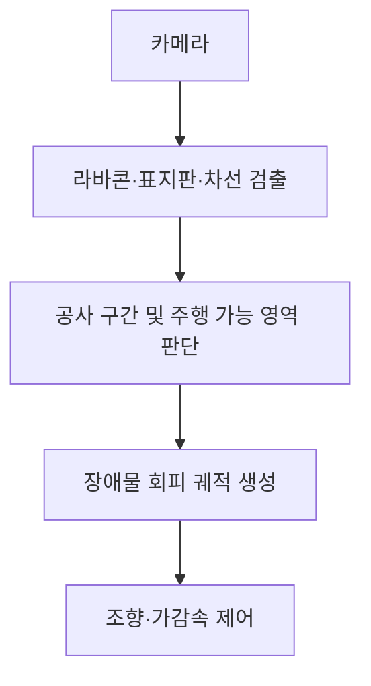

VLA는 이 문제를 아래와 같이 바라보려 한다.

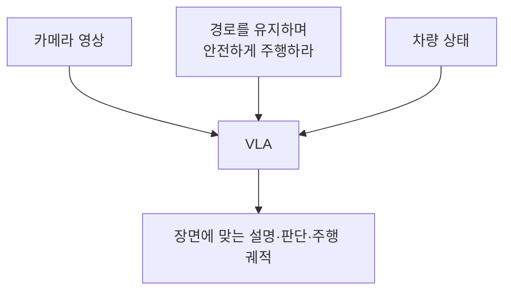

한마디로 **보고 이해해서 행동하는 모델**이다.
인간도 원래 그렇게 운전하니 구조 자체는 새롭지 않다.
차이는 세 단계를 각각 구현하지 않고 대규모 멀티모달 모델에 함께 학습시킨다는 점이다.

## II. Why Does Language Matter?

Vision과 Action만 연결하는 방식은 이미 오래전부터 존재했다.
카메라 영상을 입력받아 조향각을 바로 출력하는 모델도 Vision-Action 모델이라고 부를 수 있다.

$$
\text{Camera Image}
\quad\xrightarrow{\text{Neural Network}}\quad
\text{Steering}
$$

이 정도라면 그냥 end-to-end 자율주행이지, 굳이 VLA라는 새 간판을 달 이유는 없다.
그렇다면 Language는 왜 필요한가?
먼저 세 종류의 데이터를 비교해 보자.

첫 번째는 **이미지와 언어가 짝지어진 데이터**다.
인터넷에는 사진과 설명, 물체 이름, 사용법, 질문과 답변이 많다.

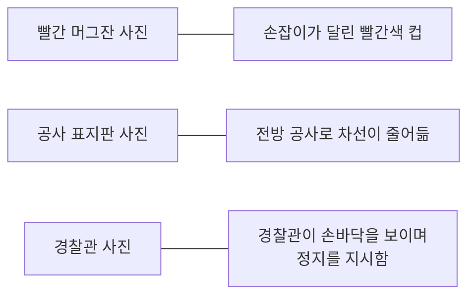

이 데이터로 모델은 이미지와 언어의 개념을 연결한다.
예를 들어 빨간색을 구별하고, 머그잔과 종이컵을 모두 컵으로 묶고, 경찰관의 손바닥이 정지 신호임을 배운다.
Vision-Language Model(VLM)은 주로 이런 방식으로 사전 학습된다.

두 번째는 **관측과 행동이 짝지어진 데이터**다.
로봇 팔이라면 카메라 영상과 관절 상태에 실제 모터 명령이 붙어 있어야 하고, 자동차라면 카메라 영상과 차량 상태에 사람이 운전한 궤적이나 조향·가감속 값이 붙어 있어야 한다.

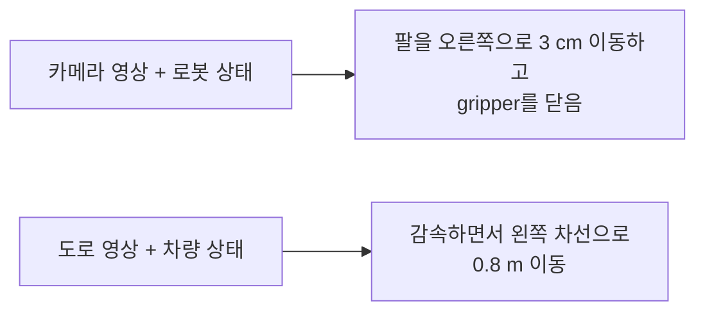

이 데이터는 인터넷에서 긁어 올 수 없다.
로봇이나 자동차를 운용하며 센서와 행동을 정확한 시간에 맞춰 기록해야 한다.
장비가 바뀌면 action vector의 차원이나 차량 동역학도 달라진다.

세 번째는 **언어 지시까지 함께 붙은 행동 데이터**다.

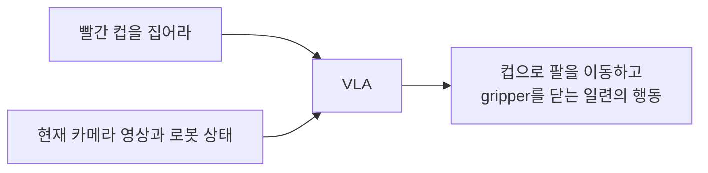

이 데이터는 행동 시연마다 언어 지시까지 표시해야 하므로 더 비싸다.
세 종류를 비교하면 다음과 같다.

| 데이터 | 상대적인 양 | 수집 난이도 |
| --- | --- | --- |
| 이미지와 언어의 쌍 | 매우 많음 | 인터넷에서 대규모 수집 가능 |
| 관측과 행동의 쌍 | 적음 | 로봇이나 자동차를 실제로 운용해야 함 |
| 언어·관측과 행동의 쌍 | 더 적음 | 실제 행동에 언어 지시까지 표시해야 함 |

여기서 VLA를 다음과 같은 직렬 구조로 오해하기 쉽다.

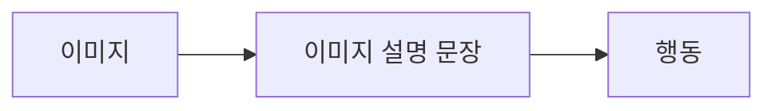

하지만 이미지 설명만으로는 움직이는 법을 배울 수 없다.
“빨간 신호등이 있다”는 문장에는 브레이크를 언제 얼마나 밟을지 없고, “빨간 컵이 있다”는 문장에는 관절을 몇 rad 움직일지 없다.
따라서 VLA에도 **관측→행동 데이터가 반드시 필요하다.**
Language는 행동 데이터를 대체하지 않는다.

Language가 하는 일은 행동 데이터 한 건을 더 넓은 상황에 활용할 수 있도록 **의미적인 연결고리**를 제공하는 것이다.
예를 들어 다음과 같은 로봇 행동 데이터만 모았다고 하자.

```text
학습 시연 1: 파란 종이컵을 집는다.
학습 시연 2: 흰색 플라스틱 컵을 집는다.
학습 시연 3: 노란 컵을 집는다.
```

Vision-Action 모델은 이 시연에서 특정 모양의 컵을 집는 패턴을 배운다.
그러나 처음 보는 빨간 머그잔을 같은 부류로 인식하지 못할 수 있다.
행동 데이터만 쓴다면 머그잔, 유리잔, 계량컵 등을 직접 집는 시연을 계속 추가해야 한다.

반면 VLM은 종이컵, 머그잔, 유리잔을 이미 `cup`이라는 개념으로 연결했을 수 있다.
여기에 컵을 집는 행동을 학습하면, 처음 보는 머그잔에도 같은 행동을 일반화할 수 있다.

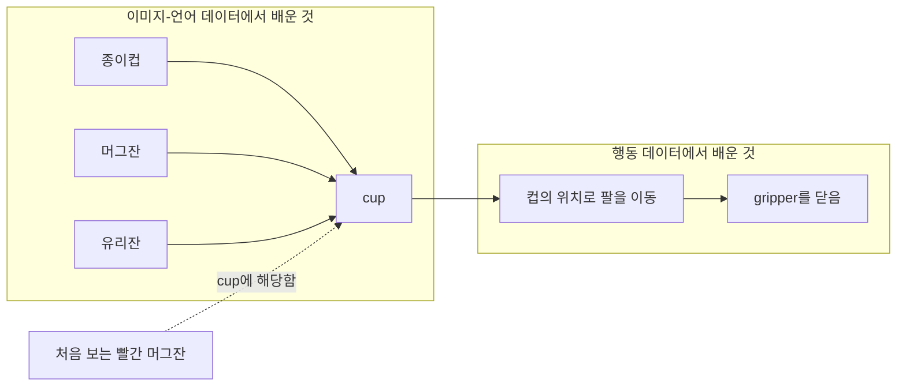

실제 신경망 안에 `cup`이라는 상자가 따로 있는 것은 아니다.
이미지와 단어가 가까운 표현을 갖도록 사전 학습되므로, 제한된 행동을 의미가 비슷한 물체에 일반화하기 쉬워진다는 뜻이다.

자율주행도 같다.
Vision-Action 모델에 공사 구간 주행을 가르치려면 다양한 라바콘, 임시 표지판, 작업자, 차선 폐쇄 형태를 수집해야 한다.
학습에서 보지 못한 표지판이나 수신호는 픽셀 패턴만으로 의미를 파악하기 어렵다.

VLM은 이미지-언어 사전 학습을 통해 다음과 같은 관계를 미리 배울 수 있다.

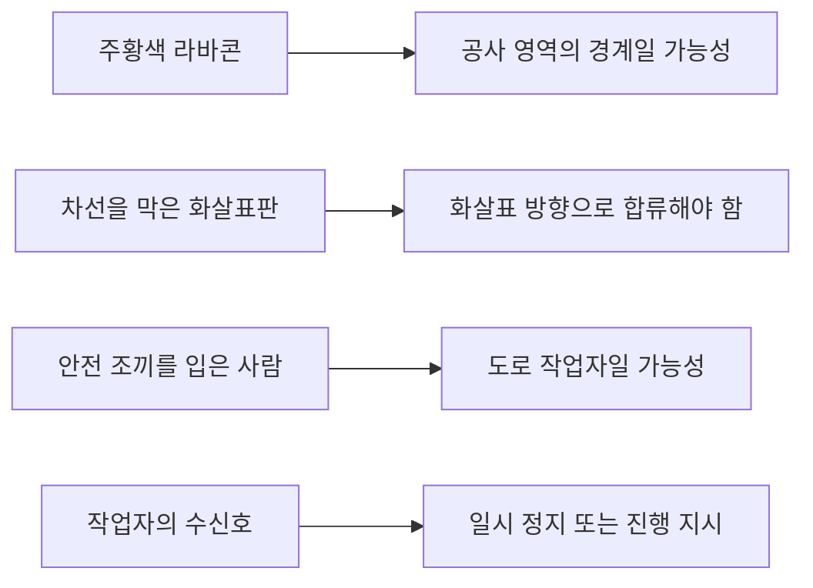

그래도 실제 주행 데이터는 필요하다.
모델은 공사 구간에서 언제 감속하고, 얼마나 여유를 두며, 어떤 궤적으로 합류할지 별도로 배워야 한다.
VLA는 이 제한된 주행 경험을 VLM이 아는 다양한 표지판과 작업 상황에 연결한다.

따라서 핵심 질문은 다음과 같다.

> 이미지와 행동이 함께 기록된 데이터는 비싸고 부족하다. 그렇다면 대규모 이미지-텍스트 데이터로 세상의 물체와 상황을 이해하는 법을 먼저 학습한 뒤, 비교적 적은 행동 데이터로 그 이해를 실제 움직임에 연결할 수 없을까?

이를 학습 단계로 나타내면 아래와 같다.

$$
\underbrace{\text{Vision-Language Pretraining}}_{\text{웹 규모의 의미 지식}}
+
\underbrace{\text{Action Data}}_{\text{실제 움직이는 법}}
\longrightarrow
\text{VLA}
$$

VLA는 `이미지→언어→행동`이라는 직렬 파이프라인이 아니다.
**풍부한 이미지-언어 데이터**와 **희소한 행동 데이터**를 한 모델에서 결합한다.
언어는 같은 행동 경험을 더 많은 물체와 상황에 일반화하도록 돕는다.

Google DeepMind의 [RT-2](https://robotics-transformer2.github.io/)가 초기 사례다.
RT-2는 웹의 이미지-텍스트 데이터와 로봇 조작 데이터를 함께 학습했다.
“망치로 쓸 수 있는 물체를 집어라”라는 지시에 돌을 고르는 등, 행동 데이터에서 직접 보지 못한 개념을 행동에 활용했다.

자율주행도 픽셀과 조향값의 상관관계를 넘어, 위험의 의미와 운전 지시를 같은 표현 공간에서 다루는 것이 목표다.

VLA의 Language가 반드시 자연어 문장을 생성한다는 뜻은 아니다.
자동차가 매 제어 주기마다 “음, 전방의 보행자가 수상하군. 브레이크를 밟아야겠어”라고 독백한 다음 브레이크를 밟는 것은 아니다.
언어는 다음 세 가지 형태로 관여할 수 있다.

1. **사전 학습의 매개체**: 이미지와 텍스트를 함께 학습해 세상의 개념을 익힌다.
2. **입력 인터페이스**: “다음 교차로에서 좌회전”, “승차감보다 신속한 주행을 우선”과 같은 지시를 받는다.
3. **중간 또는 보조 출력**: 장면 설명이나 판단 근거를 생성한 뒤 행동을 출력한다.

모델에 따라 일부만 사용하기도 하고 세 가지를 모두 사용하기도 한다.
따라서 VLA는 **언어로 학습한 의미 표현을 시각 정보와 물리적 행동에 연결한 정책(policy)** 에 가깝다.

## III. Inside a VLA

VLA의 구현은 매우 다양하지만, 큰 덩어리만 보면 다음과 같이 나눌 수 있다.

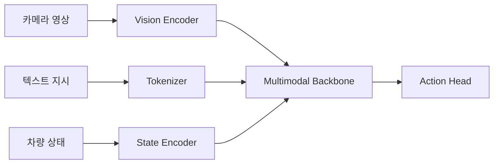

### III.1. Vision: Turning Images into Tokens

카메라 이미지는 먼저 Vision Transformer(ViT)와 같은 비전 인코더를 통과한다.
인코더는 이미지를 여러 패치로 나누고, 각 패치의 내용을 벡터로 표현한다.
이를 흔히 **visual token** 또는 **image embedding**이라고 부른다.

예를 들어 $$224\times224$$ 이미지를 $$16\times16$$ 패치로 자르면 $$14\times14=196$$개의 조각이 생긴다.
각 조각은 “왼쪽 위에 빨간색 모서리가 있음”, “세로 방향의 흰 선이 있음” 같은 시각 특징을 수백 또는 수천 차원의 숫자로 담는다.
전방 영상에 보행자, 횡단보도, 적색 신호가 있더라도 모델이 처음부터 아래처럼 깔끔한 객체 목록을 받는 것은 아니다.

```text
pedestrian: (x=812, y=421, distance=18.2 m)
crosswalk: detected
traffic_light: RED
```

대신 196개 패치 벡터를 받아 어느 패치들이 서로 관련되는지 학습한다.
명시적인 3D 객체 검출기 없이 필요한 장면 표현을 직접 학습할 수도 있다.

여러 대의 카메라와 과거 프레임을 사용하면 입력은 더 커진다.
사진 한 장으로는 주차 차량과 서서히 움직이는 차량을 구분하기 어려우므로 시간 정보도 필요하다.
모델은 여러 시점의 영상을 압축하거나 시공간 attention으로 움직임을 표현한다.

Token과 Attention이 갑자기 외계어처럼 느껴진다면 필자가 PlanT를 공부하며 정리한 [Transformer Encoder](/docs/reproducing-papers/00-plan-t/01-transformer-encoder)를 먼저 보는 편이 낫다.
VLA도 입력 종류가 많아졌을 뿐, “각 입력을 token으로 바꾸고 서로 필요한 정보를 attention으로 가져온다”는 뼈대는 같다.

### III.2. Language: Turning Instructions into Tokens

“200 m 앞에서 우회전” 같은 문장은 tokenizer를 거쳐 text token으로 변환된다.
멀티모달 backbone은 visual token과 text token을 함께 읽으며 둘 사이의 관계를 학습한다.

예를 들어 tokenizer는 문장을 모델의 vocabulary에 따라 다음과 비슷하게 자른다.

```text
"200 m 앞에서 우회전"
→ ["200", "m", "앞에서", "우회전"]
→ [token 391, token 76, token 8214, token 19203]
```

이 token ID도 embedding vector로 바뀐다.
이제 모델 안에서는 이미지 패치와 단어가 모두 벡터이므로 같은 Attention 연산에 들어갈 수 있다.
`우회전` token이 오른쪽 차선, 우회전 화살표, 교차로 모서리에 해당하는 visual token을 참고하는 식이다.

```text
[전방 영상 토큰] [측방 영상 토큰]
[현재 속도: 32 km/h]
[경로 지시: 다음 교차로에서 우회전]
```

언어 입력은 내비게이션 명령뿐 아니라 task prompt로도 사용한다.

```text
"앞으로 5초 동안의 안전한 주행 궤적을 생성하라."
"위험 요소를 설명하라."
"교통 신호의 상태와 정지 필요 여부를 출력하라."
```

같은 backbone에 서로 다른 prompt를 주어 궤적 생성, 객체 검출, 장면 설명을 수행할 수도 있다.
Waymo의 [EMMA](https://waymo.com/research/emma/)가 이런 접근을 사용한다.
EMMA는 카메라 영상과 텍스트 입력을 받아 주행 궤적뿐 아니라 3D 객체와 road graph도 통일된 언어 공간에서 출력하도록 학습되었다.

### III.3. Action: Turning Model Outputs into Motion

언어 모델은 원래 다음 단어를 예측하지만, 자동차에는 조향·가감속 값이나 미래 궤적이 필요하다.
이를 출력하는 방법은 여러 가지다.

#### Method 1: Tokenize Actions

RT-2와 [OpenVLA](https://openvla.github.io/)는 연속적인 로봇 행동을 여러 구간으로 양자화하고 각 구간을 토큰에 대응시켰다.
가령 조향값의 범위가 $$[-1, 1]$$이고 이를 256개 구간으로 나눈다면 아래처럼 표현할 수 있다.

$$
\delta=-0.21
\quad\longrightarrow\quad
\texttt{<STEER\_101>}
$$

가속도와 미래 위치도 같은 방식으로 토큰화한다.
그러면 언어 모델은 단어 대신 행동 토큰을 생성할 수 있다.

```text
<STEER_101> <ACCEL_083> <X_127> <Y_142> ...
```

출력 토큰은 다시 행동값으로 변환한다.
기존 VLM의 출력 구조를 활용할 수 있지만, 양자화로 정밀도가 떨어지고 순차 생성으로 지연시간이 늘 수 있다.

#### Method 2: Predict Continuous Actions

별도의 action head가 연속 궤적이나 제어값을 직접 회귀할 수도 있다.

$$
\hat{\tau}
=
\{(x_1,y_1), (x_2,y_2), \ldots, (x_T,y_T)\}
$$

$$\hat{\tau}$$는 앞으로 $$T$$개 시점의 예측 궤적이다.
미래 궤적을 출력하고 검증된 하위 제어기가 추종하게 하면, 차량마다 다른 조향 특성과 동역학을 분리할 수 있다.

#### Method 3: Generate Multiple Candidate Actions

실제 운전에는 정답이 하나만 존재하지 않는다.
앞차를 좌측으로 추월할 수도 있고, 속도를 줄여 뒤따를 수도 있다.
두 궤적이 모두 정답인데 회귀 모델이 평균만 내면, 앞차를 따라가지도 추월하지도 않고 그 엉덩이로 직진하는 제3의 궤적이 나올 수 있다.
수학적으로는 평균인데 운전으로는 사고다.

이 문제는 필자가 블로그에서 재현했던 [PlanT의 waypoint decoder](/docs/reproducing-papers/00-plan-t/04-main-contribution)와 비교하면 이해하기 쉽다.
PlanT의 GRU decoder는 이전 waypoint와 target point를 받아 4개의 waypoint를 순서대로 출력하고, 정답 waypoint와의 L1 거리로 학습한다.
주어진 장면에서 대표 궤적 하나를 정확히 맞히는 구조다.

반면 **Diffusion**은 궤적 하나를 바로 찍기보다, 그 장면에서 가능한 궤적들이 어디에 몰려 있는지를 학습한다.
이미지 Diffusion이 TV의 지지직거리는 노이즈에서 고양이 사진을 복원하듯이, Action Diffusion은 개판으로 흩어진 waypoint를 운전 가능한 궤적으로 고친다.

##### What Is Being Diffused?

이미지 Diffusion은 픽셀에 노이즈를 넣는다.
자율주행 Diffusion은 미래 궤적의 좌표에 노이즈를 넣는다.
앞으로 4개 waypoint를 예측한다면 깨끗한 궤적 $$\mathbf{x}_0$$는 다음 8개 숫자를 이어 붙인 벡터다.

$$
\mathbf{x}_0
=
[x_1,y_1,x_2,y_2,x_3,y_3,x_4,y_4]
$$

예를 들어 사람이 실제로 주행한 궤적이 아래와 같다고 하자.

```text
정상 궤적:
(2.0, 0.0) → (4.0, 0.1) → (6.0, 0.2) → (8.0, 0.3)
```

여기에 Gaussian noise를 섞으면 waypoint가 도로 여기저기로 튄다.

```text
노이즈가 섞인 궤적:
(1.2, 1.8) → (5.1, -0.7) → (4.9, 2.4) → (9.3, -1.1)
```

첫 번째는 그럭저럭 도로 위에 있지만 두 번째는 연석을 긁고, 세 번째는 앞차를 들이받고, 네 번째는 인도로 올라갈 수 있다.
Diffusion 모델이 배우는 일은 이 망가진 좌표를 원래 궤적 쪽으로 되돌리는 것이다.

##### Forward Process: Break the Trajectory

학습에서는 깨끗한 궤적 $$\mathbf{x}_0$$에 조금씩 노이즈를 추가해 $$\mathbf{x}_1,\mathbf{x}_2,\ldots,\mathbf{x}_K$$를 만든다.
이를 forward process라고 한다.

$$
\mathbf{x}_k
=
\sqrt{\bar{\alpha}_k}\mathbf{x}_0
+
\sqrt{1-\bar{\alpha}_k}\boldsymbol{\epsilon},
\qquad
\boldsymbol{\epsilon}\sim\mathcal{N}(\mathbf{0},\mathbf{I})
$$

기호가 갑자기 사람을 겁주지만 내용은 단순하다.

- $$\mathbf{x}_0$$: 사람이 운전한 깨끗한 궤적
- $$\boldsymbol{\epsilon}$$: 무작위 Gaussian noise
- $$k$$: 얼마나 심하게 망가뜨릴지 정하는 단계
- $$\bar{\alpha}_k$$: 원본과 노이즈를 섞는 비율

$$k$$가 작으면 waypoint가 조금 흔들린다.
$$k$$가 크면 원래 궤적은 거의 사라지고 랜덤 좌표만 남는다.
모델은 멀쩡한 궤적부터 술 취한 지렁이 같은 궤적까지 여러 수준의 고장 사례를 보게 된다.

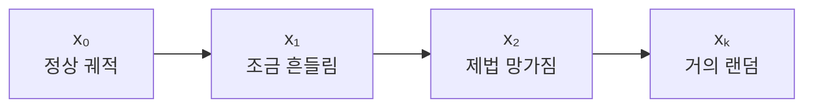

멀쩡한 궤적을 일부러 망가뜨리는 이유는 정답이 이미 있으므로 무엇을 제거해야 하는지 알 수 있기 때문이다.
학습할 때는 단계 $$k$$를 무작위로 고르고, 해당 단계의 noisy trajectory $$\mathbf{x}_k$$를 만든다.
모델은 카메라 영상, 경로 지시, 차량 상태를 조건으로 섞였던 노이즈 $$\boldsymbol{\epsilon}$$을 예측한다.

$$
\hat{\boldsymbol{\epsilon}}
=
\epsilon_\theta(\mathbf{x}_k, k, \mathbf{c})
$$

여기서 조건 $$\mathbf{c}$$에는 카메라 feature, 현재 속도, route command, 필요하다면 VLA의 reasoning feature가 들어간다.
손실은 실제로 넣은 노이즈와 모델이 예측한 노이즈의 차이다.

$$
\mathcal{L}_{\text{diffusion}}
=
\left\|
\boldsymbol{\epsilon}
-
\epsilon_\theta(\mathbf{x}_k,k,\mathbf{c})
\right\|_2^2
$$

정리하면 학습은 다음 순서다.

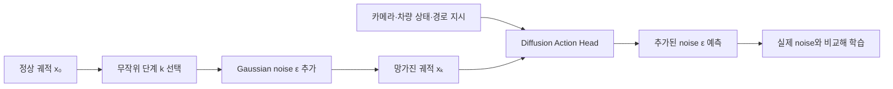

##### Reverse Process: Repair the Trajectory

추론할 때는 정답 궤적이 없으므로 완전한 Gaussian noise $$\mathbf{x}_K$$에서 시작한다.
모델이 현재 장면에 맞지 않는 노이즈를 예측해 걷어 내고, 이 과정을 $$K$$번 반복한다.

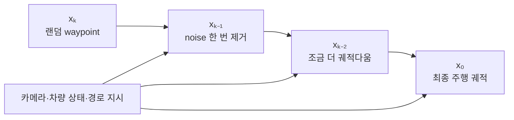

각 단계에서 모델은 장면을 조건으로 궤적을 고친다.
적신호라면 waypoint를 정지선 앞에 모으고, 왼쪽 차선이 비어 있고 route가 직진이라면 차선 안쪽으로 펴고, 보행자가 있다면 충돌하지 않는 쪽으로 밀어 내도록 학습된다.
정확히는 사람이 만든 데이터에서 그런 수정 방향을 통계적으로 배운다.
Diffusion이라는 이름만 붙였다고 교통법규가 하늘에서 내려오는 것은 아니다.

##### Why Can It Produce Multiple Trajectories?

출발점인 Gaussian noise를 바꾸면 복원 경로도 달라진다.
같은 장면에서 샘플을 세 번 뽑으면 다음처럼 서로 다른 후보가 나올 수 있다.

```text
Sample A: 현재 차선에서 감속하며 앞차를 추종
Sample B: 왼쪽 차선으로 변경한 뒤 통과
Sample C: 차선 변경을 준비하지만 현재 차선에서 대기
```

이것이 단일 회귀와 가장 크게 다른 점이다.
단일 회귀는 보통 답 하나를 내지만, Diffusion은 같은 조건에서 여러 답을 샘플링할 수 있다.
그다음 별도의 cost function이나 safety checker가 충돌, 차선 이탈, 승차감, 경로 진행도를 평가해 하나를 고른다.

물론 Diffusion이 뽑은 모든 궤적이 안전한 것은 아니다.
학습 데이터가 엉망이면 엉망인 궤적을 그럴듯하게 복원하고, 샘플링 횟수가 많으면 계산도 느려진다.
따라서 실제 시스템에는 동역학 제약, 충돌 검사, fallback planner가 여전히 필요하다.

필자가 최근 공부 중인 [Alpamayo 1](https://research.nvidia.com/publication/2025-10_alpamayo-r1)도 이 구조와 직접 관련된다.
Alpamayo 1은 VLM이 생성한 reasoning feature를 조건으로 Diffusion Trajectory Decoder가 연속 궤적을 만든다.
앞단은 “왜 양보해야 하는가”를 다루고, 뒷단은 “그래서 자동차가 실제로 어느 좌표를 지나야 하는가”를 다룬다.
필자가 VLA를 조사하다가 Diffusion 설명에서 유독 오래 멈춘 이유도 여기에 있다.
요즘 보고 있는 논문의 decoder가 바로 이 짓을 하고 있었기 때문이다.

VLA의 출력 형식은 하나가 아니다.
행동 토큰, 연속값, 행동 분포를 모두 사용할 수 있다.
공통점은 **시각 및 언어 표현을 최종 행동과 함께 학습한다**는 데 있다.

## IV. How Is a VLA Trained?

모델의 목표가 행동이라면 가장 직접적인 학습 데이터는 다음과 같은 주행 기록이다.

$$
\mathcal{D}
=
\left\{
(o_t,\, l_t,\, s_t,\, a_t)
\right\}_{t=1}^{N}
$$

- $$o_t$$: 시각 관측
- $$l_t$$: 경로 지시나 장면 설명
- $$s_t$$: 차량 상태
- $$a_t$$: 해당 상황에서 전문가가 수행한 행동

사람의 운전 로그에서 카메라 영상, 차량 상태, 주행 궤적을 시간에 맞춰 묶는다.
모델은 관측과 지시에서 전문가 행동 $$a_t$$를 재현하도록 학습한다.
이를 **behavior cloning** 또는 **imitation learning**이라고 한다.

데이터 한 건을 사람 눈에 보이는 형태로 쓰면 아래와 같다.

```text
시각 t:
  front_camera = frame_001923.jpg
  speed = 31.7 km/h
  steering = 1.2 deg
  route_command = "TURN RIGHT"

정답 행동:
  future_waypoints =
    [(2.0, 0.1), (4.0, 0.4), (5.8, 1.2), (7.1, 2.6)]
```

모델이 첫 waypoint를 $$(2.4,-0.2)$$로 예측했다면 정답 $$(2.0,0.1)$$과의 차이를 손실로 계산한다.
수백만 개 프레임에서 이 오차를 줄이면 “이런 화면과 속도와 경로 지시에서는 이런 궤적이 나와야 한다”는 mapping을 학습한다.

$$
\theta^\ast
=
\arg\min_{\theta}
\sum_t
\mathcal{L}\left(
f_\theta(o_t,l_t,s_t),\,a_t
\right)
$$

말은 거창하지만 요지는 “사람이 이렇게 봤을 때 이렇게 운전했으니 너도 따라 해라”다.

### IV.1. Pretrain on the World, Fine-Tune for Action

VLA는 보통 대규모 이미지-텍스트 데이터로 학습한 VLM에서 시작한다.
이 VLM은 운전법은 모르지만 자동차·보행자·도로 표지판과 그 관계를 안다.
주행 데이터로 fine-tuning해 이 지식을 행동과 연결한다.

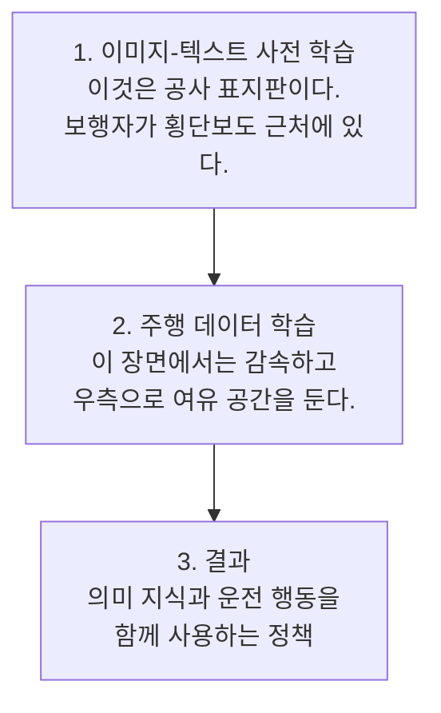

주행 데이터만 지나치게 학습하면 VLM의 기존 지식을 잊는 catastrophic forgetting이 생길 수 있다.
RT-2는 로봇 데이터와 기존의 vision-language 데이터를 함께 co-fine-tuning하여 이 문제를 줄이려 했다.
OpenVLA는 로봇 행동 데이터만으로 fine-tuning했고, 인터넷 지식이 필요한 일반화 과제에서는 RT-2-X가 더 나았다.

### IV.2. Multi-Task Training

객체 검출, road graph, 장면 설명, 위험 요소 같은 보조 과제를 주행 궤적과 함께 학습할 수도 있다.

```text
입력: 카메라 영상

과제 A: 미래 궤적을 출력하라.
과제 B: 주변 객체를 출력하라.
과제 C: 차선과 도로 경계를 출력하라.
과제 D: 왜 감속해야 하는지 설명하라.
```

과제가 장면 표현을 공유하면 서로 도움이 될 수 있다.
EMMA는 planning trajectory, object detection, road graph를 함께 학습해 각 과제의 성능을 높였다.

예를 들어 planning loss만 주면 모델은 앞차를 피하기만 하면 되고, 그 물체가 자동차인지 쓰레기통인지 명시적으로 맞힐 필요는 없다.
여기에 object detection loss를 함께 주면 “저 위치의 물체는 자동차이고 속도는 20 km/h”라는 정보도 보존하도록 압박한다.
road graph loss까지 주면 차선 경계와 진행 가능 방향도 놓치기 어렵다.
하나의 backbone을 세 과제가 동시에 갈구는 셈이고, 운 좋게 서로 필요한 정보가 겹치면 positive transfer가 생긴다.

설명 데이터는 규칙 기반 시스템, 기존 perception, 더 큰 VLM, 자동 라벨링과 사람의 검수를 조합해 만든다.
잘못된 설명이 섞이면 모델은 틀린 이유까지 자신 있게 말할 수 있다.

### IV.3. The Open-Loop Problem

전문가 로그에는 정상적인 주행 상태가 대부분이다.
실제 주행에서 작은 조향 오차로 학습하지 않은 위치에 놓이면 다음 행동의 오차가 누적될 수 있다.

예를 들어 학습 데이터에서는 자동차가 늘 차선 중앙 $$y=0$$ 부근을 달렸다고 하자.
실제 모델이 한 번 실수해 $$y=0.7\,\text{m}$$까지 밀리면 카메라에서 차선이 평소와 전혀 다른 각도로 보인다.
이 화면을 학습하지 않았다면 모델은 중앙으로 복귀하기보다 더 바깥으로 조향할 수 있다.
첫 실수는 0.7 m였지만 두 번째 실수는 연석과의 악수다.

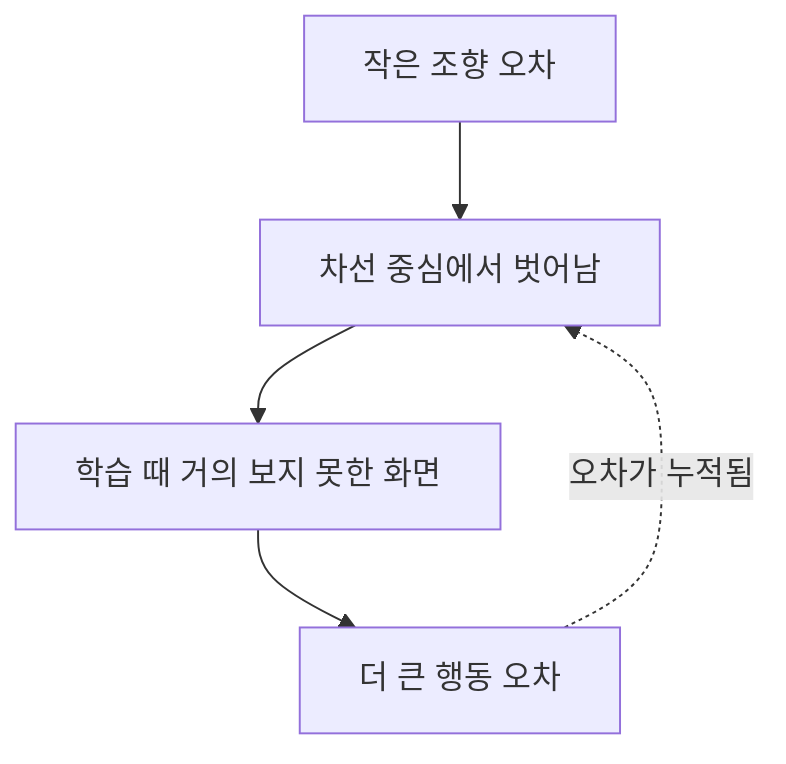

이를 distribution shift 또는 compounding error라고 한다.
따라서 정답 궤적을 맞히는 **open-loop 평가**만으로는 부족하다.
모델의 행동이 다음 관측을 바꾸는 **closed-loop simulation**에서 충돌률, 이탈률, 승차감을 평가하고 복구 데이터도 학습해야 한다.

## V. Walking Through a Driving Scene

자동차가 주택가의 신호 없는 횡단보도에 접근한다고 하자.
오른쪽의 불법 주차된 밴이 시야를 가리고, 그 뒤로 어린이의 일부만 보인다.
내비게이션은 직진을 지시한다.

### V.1. Inputs

VLA에는 다음과 같은 정보가 들어간다.

```text
Vision:
- 여러 카메라의 최근 프레임
- 밴에 가린 횡단보도 주변 영상

Language:
- "현재 도로를 따라 직진"
- 필요하다면 "안전을 우선하여 주행"

Vehicle State:
- 현재 속도 32 km/h
- 조향각 1.2 deg
- 이전 궤적과 가속도
```

### V.2. Scene Representation

멀티모달 backbone은 영상에서 다음 관계를 표현해야 한다.

- 횡단보도가 존재한다.
- 밴 때문에 보이지 않는 영역이 있다.
- 어린이로 보이는 물체가 밴 뒤에 일부 가려져 있다.
- 어린이는 갑자기 도로로 진입할 가능성이 있다.
- 현재 속도로는 즉시 정지하기 어렵다.

전통적인 시스템은 이를 object list, occupancy grid, predicted trajectory로 표현한다.
VLA에서는 상당 부분이 latent representation 안에 있을 수 있다.

### V.3. Reasoning

reasoning 출력을 사용하는 모델이라면 다음과 비슷한 중간 결과를 만들 수 있다.

```text
횡단보도 우측이 주차 차량에 가려져 있고 어린이가 일부 관측된다.
보이지 않는 영역에서 보행자가 진입할 가능성이 있으므로 횡단보도 전에 감속한다.
```

이 문장은 판단을 보여 주거나 궤적 생성의 조건으로 쓸 수 있다.
그러나 그럴듯한 문장이 올바른 행동을 보장하지는 않는다.
행동 뒤에 설명을 사후 생성했을 수도 있으므로 reasoning text는 안전성의 증명이 아니다.

### V.4. Action

모델은 다음 몇 초의 궤적과 속도 계획을 출력한다.

```text
t = 0.0 s : 32 km/h
t = 1.0 s : 24 km/h
t = 2.0 s : 13 km/h
t = 3.0 s : 횡단보도 전 정지 가능 상태
```

하위 controller는 궤적을 따라 steering, throttle, brake 명령을 계산한다.
다음 프레임이 들어오면 VLA는 궤적을 갱신한다.
어린이가 멈추면 서행하고, 도로로 뛰어나오면 정지한다.
이 반복이 closed-loop control이다.

한 번 멋진 답을 내는 것보다 **짧은 주기로 관측하고 행동을 수정하는 능력**이 중요하다.
챗봇은 답변을 2초쯤 고민해도 사용자가 한숨 한 번 쉬고 말지만, 시속 60 km로 달리는 자동차는 그동안 약 33 m를 이동한다.
VLA가 아무리 박학다식해도 실시간성이 없으면 자동차 입장에서는 그저 말이 많은 승객일 뿐이다.

## VI. Modular, End-to-End, and VLA

이제 세 접근을 한 줄씩 놓고 비교해 보자.

| 구분 | 전통적 modular stack | Vision-Action end-to-end | VLA |
| --- | --- | --- | --- |
| 입력 | 센서, 지도, 경로 | 주로 센서와 차량 상태 | 센서, 차량 상태, 언어 지시 |
| 중간 표현 | 객체, 차선, 예측 궤적 등 명시적 | 대부분 latent | latent + 선택적 언어/구조화 출력 |
| 출력 | 계획 궤적 또는 제어값 | 궤적 또는 제어값 | 언어, 궤적, 제어값 등 |
| 학습 단위 | 모듈별 학습과 규칙 설계 | 입력부터 행동까지 공동 학습 | VLM 사전 학습 + 행동 공동 학습 |
| 장점 | 디버깅과 검증이 비교적 쉬움 | 전체 목적에 맞춘 최적화 | 의미 지식, 지시 이해, 일반화 가능성 |
| 약점 | 인터페이스와 규칙이 복잡함 | 해석이 어렵고 분포 변화에 취약 | 계산량, 데이터, 검증 문제가 더 커짐 |

전통적 구조는 perception, prediction, planning, control을 각각 나눈다.
각 모듈의 책임이 명확하기 때문에 “보행자를 놓쳤는가, 미래 궤적을 틀리게 예측했는가, planner가 무리했는가”를 추적하기 쉽다.
또한 교통법규와 안전 제약을 planner에 명시적으로 넣기 좋다.

반면 모듈 사이에서 정보가 손실되고 오차가 전파될 수 있다.
perception이 객체를 `car` 박스로 요약하면 비상등이나 운전자의 손짓 같은 정보가 사라질 수 있다.
예외 규칙도 계속 관리해야 한다.

Vision-Action end-to-end 모델은 센서 입력부터 행동까지 공동 학습한다.
중간 인터페이스가 필요 없지만 행동의 원인을 알기 어렵고 분포 밖의 상황에 취약할 수 있다.

VLA는 여기에 vision-language 사전 학습과 언어 인터페이스를 결합한 **foundation model 시대의 end-to-end policy**에 가깝다.

실제 제품은 세 접근을 섞을 수 있다.
VLA가 후보 궤적을 만들고 safety checker가 검사하거나, VLA는 고수준 판단만 하고 기존 planner와 controller가 저수준 행동을 맡을 수 있다.

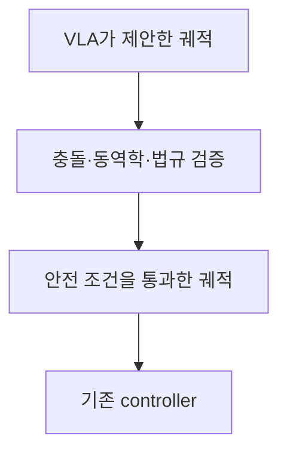

안전이 중요한 현실에서는 이런 hybrid 구조가 자연스럽다.
“end-to-end”가 모든 기존 소프트웨어를 없앤다는 뜻은 아니다.

## VII. What Does VLA Buy Us?

### VII.1. Semantic Generalization

가장 큰 기대는 학습에서 보지 못한 상황을 기존 개념으로 해석하는 능력이다.

예를 들어 도로 위에 매트리스가 떨어져 있다고 하자.
detector의 클래스에 `mattress`가 없다면 unknown obstacle로 처리된다.
충돌 회피에는 충분할 수 있지만, 매트리스는 바람에 움직이거나 사람이 회수하러 들어올 수도 있다.
VLM의 지식은 이런 추론의 실마리를 준다.

### VII.2. Natural-Language Interface

운전자나 승객은 언어로 의도를 전달한다.

- “여기 말고 편의점 앞에 세워 줘.”
- “차가 너무 흔들리니 천천히 가 줘.”
- “구급차가 지나갈 수 있게 오른쪽으로 붙어 줘.”

기존 시스템은 각 지시를 별도의 UI와 규칙으로 구현해야 한다.
VLA는 언어를 공통 인터페이스로 사용한다.
다만 모호한 표현을 처리하려면 안전 제약과 사용자 선호 모델이 필요하다.

### VII.3. Knowledge Sharing Across Tasks

장면 설명, 객체 이해, road graph, 궤적 생성을 함께 학습하면 과제 간에 지식을 공유할 수 있다.
주행 궤적 라벨이 없는 데이터도 이미지 설명이나 객체 라벨로 backbone 학습에 쓸 수 있다.

### VII.4. A Window into Decision-Making

위험 요소와 행동 근거를 언어로 출력하면 디버깅과 사용자 설명에 도움이 된다.
그러나 설명이 실제 의사결정 과정을 반영한다고 보장할 수 없으므로 행동과의 인과적 일치성을 따로 평가해야 한다.

## VIII. Representative Models

### VIII.1. RT-2: Treating Actions as Language

2023년에 공개된 RT-2는 VLA라는 이름을 널리 알렸다.
VLM을 vision-language 데이터와 로봇 궤적으로 함께 fine-tuning하고 위치·회전·gripper 명령을 텍스트 토큰처럼 출력한다.
행동을 토큰화해 VLM의 학습 방식을 크게 바꾸지 않고 로봇을 제어한 것이 핵심이다.
6,000회가 넘는 평가에서 새로운 객체, 배경, 환경과 지시에 대한 일반화를 보였다.

다만 대상은 주로 탁상 물체를 집는 저속 로봇이다.
고속으로 달리는 자동차에 그대로 적용할 수는 없다.

### VIII.2. OpenVLA: An Open-Source VLA

OpenVLA는 7B 규모의 오픈소스 로봇 VLA다.
SigLIP과 DINOv2를 결합한 vision encoder, projector, Llama 2 기반 language model이 행동 토큰을 예측한다.
약 97만 개의 로봇 에피소드로 여러 종류의 로봇을 학습했다.

구조는 명료하다.
이미지를 embedding으로 바꾸고 LLM 입력 공간에 투영한 뒤 행동 토큰을 예측한다.

### VIII.3. EMMA: Unifying Autonomous-Driving Outputs

Waymo가 2024년에 공개한 EMMA는 Gemini 기반의 end-to-end 자율주행 연구다.
raw camera input에서 planner trajectory, 3D object, road graph를 생성하며, 센서 외 입력과 출력은 가능한 한 자연어로 표현한다.

reasoning은 planning 성능을 높였고, planning·object detection·road graph의 공동 학습에서는 positive transfer가 나타났다.
다만 처리할 수 있는 프레임이 적고 LiDAR와 radar를 사용하지 않으며 계산 비용이 크다.

### VIII.4. Alpamayo 1: Aligning Reasoning and Trajectories

NVIDIA의 Alpamayo 1은 long-tail 상황을 겨냥한 reasoning VLA다.
인과적 reasoning과 미래 궤적을 함께 학습하고 Diffusion Decoder로 연속 궤적을 생성한다.
supervised fine-tuning과 reinforcement learning으로 reasoning의 품질과 행동의 일관성을 높인다.

최근 연구는 **reasoning과 행동의 일치**, **동역학적으로 가능한 궤적**, **closed-loop 안전성**에 집중한다.

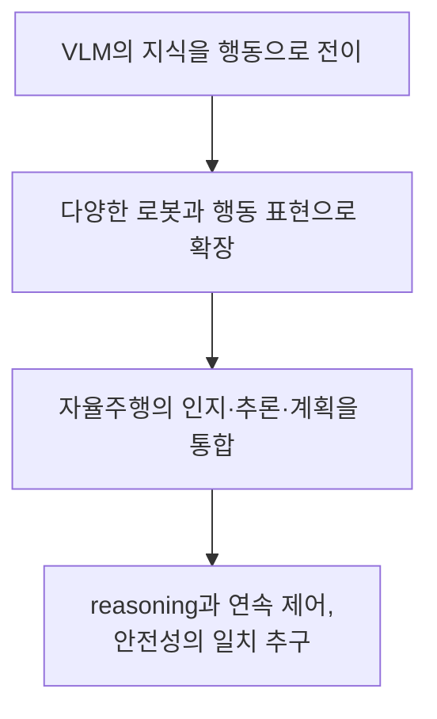

## IX. Open Problems

VLA는 비, 오염된 센서, 공사 구간, 돌발 행동이 있는 현실에서 안전하게 작동해야 한다.
벤치마크의 최고 점수만으로는 부족하다.

### IX.1. Real-Time Inference

거대한 VLM은 여러 카메라와 과거 프레임을 처리해야 한다.
reasoning과 궤적까지 autoregressive하게 생성하면 지연시간이 커진다.

평균뿐 아니라 최악 지연시간도 중요하다.
평소 50 ms 만에 답하다가 가끔 2초 동안 깊은 사색에 잠기는 모델은 쓸 수 없다.
모델 압축, token 수 감소, 빠른 action head, 비동기적인 고수준 reasoning과 저수준 제어의 분리 등이 필요하다.

### IX.2. 3D and Temporal Understanding

이미지-텍스트 모델은 주로 2D 이미지에 강하지만, 운전에는 거리, 속도, 가속도, 가려짐 같은 3D·시간 정보가 필요하다.
“차가 있다”는 인식과 그 차가 1.2초 뒤 내 차선을 침범할지 예측하는 것은 다른 문제다.

따라서 여러 프레임, LiDAR, radar, 지도와 차량 상태를 결합하고 긴 사건을 기억해야 한다.
조금 전 공사 안내원이 우회하라고 지시한 사실을 모퉁이를 돈 뒤 바로 잊어버리면 곤란하다.

### IX.3. Limited and Biased Action Data

품질 좋은 행동 데이터는 적고, 실제 주행 로그 대부분은 평범한 직진과 정차다.
사고 직전이나 희귀 공사 구간 같은 중요한 데이터는 부족하다.

사람의 운전도 항상 정답은 아니다.
단순한 imitation learning은 좋은 솜씨와 함께 과속, 짧은 차간 거리 같은 나쁜 습관도 복제한다.

### IX.4. Hallucination and Unfaithful Reasoning

VLM은 없는 물체를 보거나 표지판을 잘못 읽고도 자신 있게 설명할 수 있다.
채팅에서의 환각은 정정하면 되지만 운전에서의 환각은 차선을 바꿀 수 있다.

자연어 reasoning도 검증하기 어렵다.
“보행자 때문에 감속한다”고 말했어도 궤적 생성에는 보행자 정보가 쓰이지 않았을 수 있다.
설명의 문법적 품질이 아니라 perception-reasoning-action의 정합성을 평가해야 한다.

### IX.5. Safety Validation

수십억 개 파라미터를 가진 모델의 행동을 모든 상황에서 증명하기는 어렵다.
따라서 여러 층위의 평가가 필요하다.

- 기록된 데이터에서의 open-loop 궤적 오차
- interactive simulation에서의 충돌 및 교통법규 위반
- 새로운 날씨·지역·객체에 대한 robustness
- 센서 고장과 적대적 입력에 대한 대응
- reasoning과 action의 일치성
- 실제 차량에서의 최악 지연시간
- 안전 제약 위반 시 fallback 동작

open-loop에서 사람의 궤적과 비슷하다는 것만으로는 부족하다.
행동이 다음 장면을 바꾸므로 대규모 closed-loop 검증이 필수다.

### IX.6. Debugging and Fault Attribution

이상한 궤적이 perception, reasoning, trajectory generation, controller 중 어디서 발생했는지 찾아야 한다.

표현이 모두 latent space에 숨으면 인터페이스 문제와 함께 디버깅할 손잡이도 사라진다.
객체, occupancy, reasoning, uncertainty 같은 보조 출력이나 별도 안전 모듈이 필요한 이유다.

## X. Conclusion

처음에는 VLA를 Vision, Language, Action을 한데 묶은 AI 종합 선물 세트라고 생각했다.
구현은 복잡하지만 문제의식은 명확하다.

1. VLM은 웹 규모의 이미지와 언어에서 풍부한 의미 지식을 배운다.
2. 이 지식을 로봇의 행동 데이터와 함께 학습한다.
3. 시각적 관측과 언어적 지시를 실제 행동으로 직접 연결한다.
4. 학습 데이터에서 보지 못한 객체와 상황에도 의미 지식을 활용하기를 기대한다.

자율주행 VLA는 카메라에서 조향각을 바로 뽑는 end-to-end 모델보다 범위가 넓다.
운전 장면, 언어 지시, 상식을 함께 다루고 판단 근거와 미래 궤적을 생성할 수 있다.

전통적인 인지-판단-제어 구조가 곧 사라지는 것은 아니다.
VLA에는 실시간성, 3D·시간 이해, 행동 데이터, 환각, closed-loop 검증 문제가 남아 있다.
자동차에서 “대체로 잘한다”와 “안전하다”는 전혀 다르다.

따라서 VLA는 완성된 아키텍처보다 다음 연구 방향에 가깝다.

> **세상을 보고 말로 이해하는 foundation model의 능력을, 실제 세계에서 안전하게 행동하는 능력으로 연결하려는 시도**

VLA의 목표는 표지판 검출을 넘어 그 의미와 대응 행동까지 하나의 학습 체계에서 다루는 것이다.
성공하면 자율주행은 훨씬 유연해질 수 있다.
실패하면 자동차가 틀린 판단을 유창하게 설명할 것이다.
적어도 이제 필자는 VLA라는 이름을 들어도 당최 감이 오지 않는 상태에서는 벗어났다.

## References

1. [RT-2: Vision-Language-Action Models Transfer Web Knowledge to Robotic Control](https://robotics-transformer2.github.io/)
2. [OpenVLA: An Open-Source Vision-Language-Action Model](https://openvla.github.io/)
3. [EMMA: End-to-End Multimodal Model for Autonomous Driving](https://waymo.com/research/emma/)
4. [Alpamayo 1: Bridging Reasoning and Action Prediction for Generalizable Autonomous Driving in the Long Tail](https://research.nvidia.com/publication/2025-10_alpamayo-r1)
5. [End-to-end Autonomous Driving: Challenges and Frontiers](https://arxiv.org/abs/2306.16927)


<script src="https://utteranc.es/client.js"
        repo="i-am-wonseoklee/i-am-wonseoklee.github.io"
        issue-term="pathname"
        theme="github-dark-orange"
        crossorigin="anonymous"
        async>
</script>
